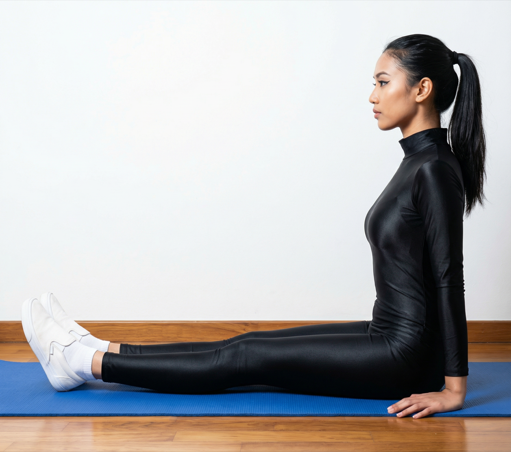

# Dandasana

[TOC]

**Dandasana** is the Sanskrit word. The word **Danda** means – Stick and **Asana** means Pose. Dandasana Yoga (Staff pose) is the simple and effective sitting pose to improve posture, strengthen your abdomen, chest, shoulder and back muscles. Let’s check steps and benefits of Dandasana (Staff Pose).

## Technique
1. Sit erect on the ground, with your back straightened and your legs stretched out in front of you. Your legs must be parallel to each other, and feet should be pointed upwards.
1. Press your buttocks on the floor, and align your head in such a way that the crown faces the ceiling. This will automatically straighten and lengthen your spine.
1. Flex your feet and press your heels.
1. Place your palms next to your hips on the floor. This will support your spine and also relax your shoulders. Your torso must be straight, but relaxed.
1. Relax your legs, and ground the lower half of your body firmly to the floor.
1. Breathe normally, and hold the pose for about 20 to 30 seconds.

## Technique in pictures/animation
## Effects
* Helps improve posture
* Strengthens back muscles
* Lengthens and stretches the spine
* May help to relieve complications related to the reproductive organs
* Stretches shoulders and chest
* Nourishes your body’s resistance to back and hip injuries
* Helps to calm brain cells
* May improve functionality of the digestive organs
* Creates body awareness
* Helps improve alignment of body
* Provides a mild stretch for hamstrings

## Related Asanas
* [Adho Mukha Svanasana](../yoga/Adho_Mukha_Svanasana.md)
* [Uttanasana](../yoga/Uttanasana.md)

## Special requisites
These are some points of caution you must keep in mind before you practice this asana.

* It is best to avoid this asana if you have a lower back or a wrist injury.
* Although this is a fairly simple pose, it is best to do it under the supervision of a yoga instructor. When you practice yoga, remember to listen to your body and push only as much as it can endure.
## Initial practice notes
Lay one to three 10-pound sandbags across the tops of your thighs at the hip crease to help ground your thighs.

## References

## External Links
* [Dandasana on finessyoga.com](http://www.finessyoga.com/yoga-asanas/dandasana-steps-benefits)
* [Dandasana on eyogaguru.com](https://eyogaguru.com/dandasana-yoga-staff-pose-steps-and-benefits/)
* [Dandasana on sarvyoga.com](https://www.sarvyoga.com/dandasana-staff-pose-steps-and-benefits/)

## References

1. ["Methodology"](http://www.stylecraze.com/articles/dandasana-staff-pose/#gref)
2. [tips"]("Beginers)(https://www.yogajournal.com/poses/staff-pose)
3. ["Benefits"](http://www.cnyhealingarts.com/2010/11/29/the-health-benefits-of-dandasana-staff-pose-or-stick-pose/)
