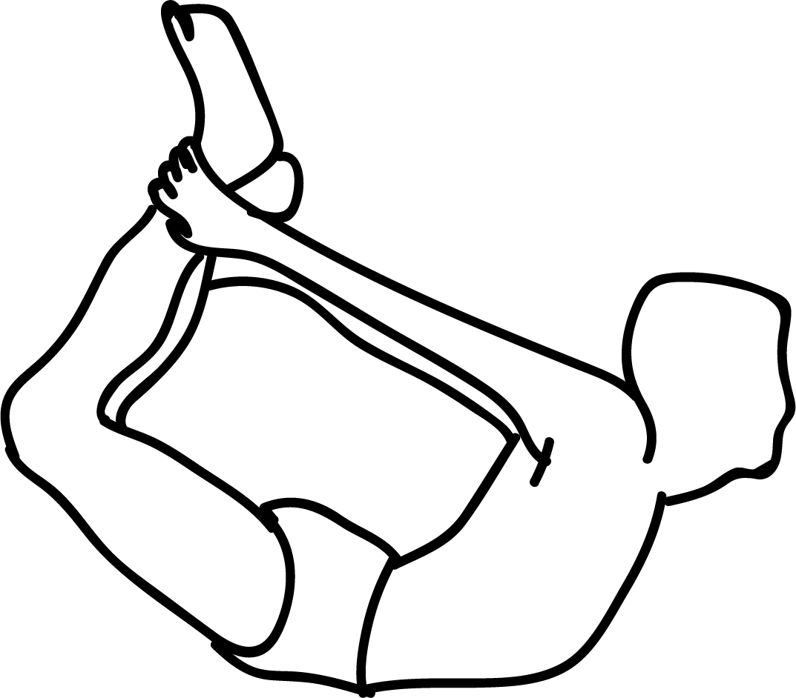

# Dhanurasana

[TOC]

**Dhanurasana** or the Bow Pose is one of the 12 basic Hatha Yoga poses. It is also one of the three main back stretching exercises. It gives the entire back a good stretch, thus imparting flexibility as well as strength to the back.

## Technique
1. Begin with lying down on your belly with your hands on either side of your torso and palms facing upwards.
1. Keep both legs a bit apart. Relax your whole body.
1. Now while exhaling, bend your knees and bring your heels as close to your buttocks as possible.
1. Now, slowly fold your knees up and hold your ankles with your hands.
1. Then raise your chin and then bend your head and neck backwards. The chest should still be touching the ground. Inhale slowly and pull your legs up.
1. Keep raising your head, neck, chin, chest, thighs and knees backwards, such that only the navel region is touching the ground. Balance your body on the navel region.
1. Hold your breath and maintain this posture until you feel the strain in your back.
1. Remain in this position for 20-30 seconds. Then slowly go back to the original position, lying quietly for a few breaths.

## Technique in pictures/animation
## Effects
* Effective in weight loss, improves digestion and appetite.
* Helps to cure dyspepsia (obesity), rheumatism and gastrointestinal problems, cures constipation.
* Improves blood circulation, gives flexibility to the back, strengthens back muscles.
* Improve the function of liver, pancreas, small intestine and big intestine.
* Act as a stress reliever, strengthens ankles, thighs, groins, chest, and abdominal organs.
* Cure menstruation disorder, improve function of kidney and liver.
* It improves posture, releases back pain, cures respiratory disorder like asthama.
* Helpful is stimulating reproductive organs.
* Improve function of the pancreas and it is beneficial in diabetes.

## Related Asanas
* [Bhujangasana](../yoga/Bhujangasana.md)
* [Salabhasana](../yoga/Salabhasana.md)
* [Supta Virasana](../yoga/Supta_Virasana.md)
* [Virasana](../yoga/Virasana.md)
* [Urdhva Mukha Svanasana](../yoga/Urdhva_Mukha_Svanasana.md)
* [Setu Bandhasana](../yoga/Setu_Bandhasana.md)
* [Sarvangasana](../yoga/Sarvangasana.md)

## Special requisites
These are some points of caution you must keep in mind before you do this asana.

* This asana should not be practiced if you suffer from a hernia, high or low blood pressure, pain in the lower back, migraines, headaches, neck injuries, or if you have had an abdominal surgery recently.
* Women should avoid this asana during pregnancy.

## Initial practice notes
When you start off, as a beginner, it might be difficult to lift your thighs off the floor. You can roll up a blanket and place it beneath your thighs to give them support to pull up.

This is one of the Asanas prescribed in [Hatha Yoga Pradipika](Hatha_Yoga_Pradipika_(book).md).

## References

## External Links
* [Dhanurasana on arogyayogaschool.com](https://arogyayogaschool.com/blog/benefits-of-bow-pose-dhanurasana/)
* [Dhanurasana on eyogaguru.com](https://eyogaguru.com/dhanurasana-bow-pose-yoga-benefits/)
* [Dhanurasana on gyanunlimited.com](http://www.gyanunlimited.com/health/bow-pose-dhanurasana-steps-health-benefits-and-precautions/10170/)
* [Dhanurasana on 7pranayama.com](https://7pranayama.com/dhanurasana-yoga-bow-pose-steps-health-benefits-precautions/)

## References

1. ["Methodology"](http://7pranayama.com/dhanurasana-yoga-bow-pose-steps-health-benefits-precautions/)
2. [tips"]("Beginers)(http://www.stylecraze.com/articles/dhanurasana-bow-pose-how-to-do-and-what-are-its-benefits/#Beginner’sTips)
3. ["Benefits"](https://arogyayogaschool.com/blog/15-health-benefits-of-bow-pose-yoga-dhanurasana/)
