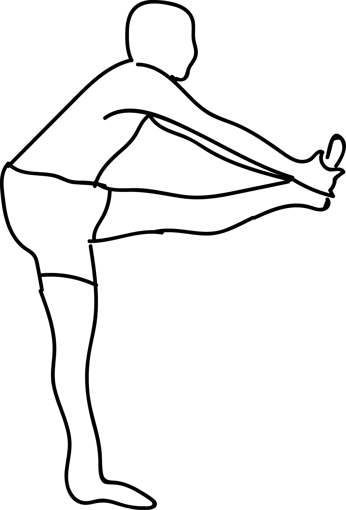

# Dwihasta Padasana

**Dvi Hasta Padasana** is an Asana. It is translated as Both Hands to Foot Pose from Sanskrit.

The name of this pose comes from "dwi" meaning "two", "hasta" meaning "hand", "pada" meaning "foot", and "asana" meaning "posture" or "seat".

## Benefits and Cautions
This pose has the following benefits: it stretches the hamstings and lower back and promotes a sense of balance.

Be careful while doing this pose if you have any hamstring injuries or lower back injuries.
