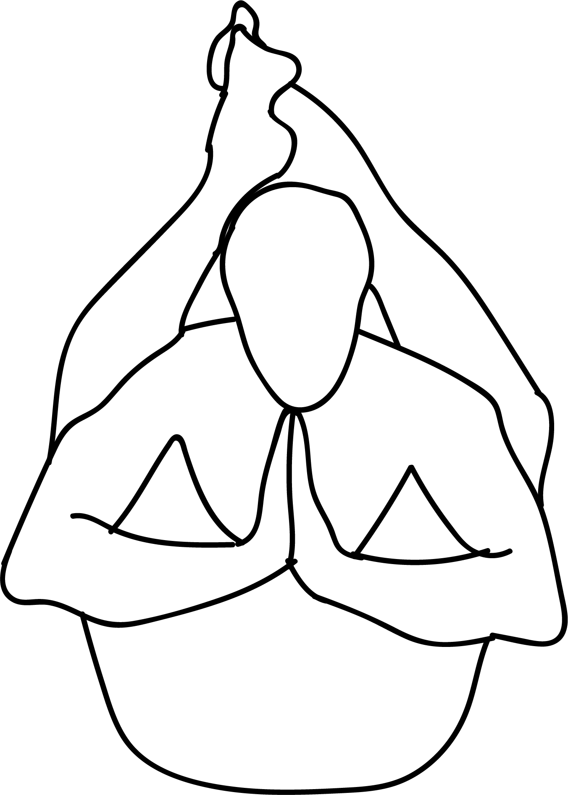

# Dwipada Sirsasana

[TOC]

**Dvi Pada Sirsasana** is an Asana. It is translated as Both Feet Behind the Head Pose from Sanskrit. The name of this pose comes from "dvi" meaning "two", "pada" meaning "foot", "sirsa" meaning "head", and "asana" meaning "posture" or "seat".

## Technique
1. Start this pose with Dandasana. Sit straight with your legs stretched out in front of you.
1. Now exhale through your nose and then hold your hand in front of it. This helps you to check which nostril is active.
1. If the right nostril is active start with the right leg and if the left nostril is active start with the left leg.
1. Now bend the knee of the active side and grab the ankle and bring it over to your head and place it slowly on your neck with exhalation.
1. Now do the same with your second leg and then place it with the first leg.

## Technique in pictures/animation
## Effects
* This pose helps to increase the blood flow and improves the levels of hemoglobin in blood. This in turn helps to eliminate many toxins from the body plus there are several other benefits of healthy blood flow.
* It is very beneficial for those who are serving from anemia and nervous trembling.
* It helps to activate the fire in you and thus also helps in the process of digestion to work properly.
* It is beneficial for the patients of diabetics.
* It makes you more active and enthusiastic.
* This pose is considered to be one of the best poses of flexibility.

## Related Asanas
* [Hugging the shin towards the chest](Hugging_the_shin_towards_the_chest.md)
* [Pigeon Pose](Pigeon_Pose.md)

## Special requisites
* Even though it is a beneficial pose there are certain things one needs to be cautious of Dwi pada sirsasana or Dwi Pada Greevasan or Both the legs behind the head pose. This pose should be avoided by people who have spinal injuries or problems with knees or hips. This is an intensive pose and can lead to injuries if one puts too much pressure while doing this pose.

## Initial practice notes
Thought Dwi pada sirsasana or Dwi Pada Greevasan or Both the legs behind the head pose is quite challenging for the beginners, it can be easily practiced. The first focus while doing this pose would be to get the legs over the neck. Once this is done then the focus can be shifted to straightening the spine and then to relax in the yoga poses. During the course of the yoga continue breathing and smiling.

## References

## External Links
* [Dvi Pada Sirsasana on artisticyoga.com](http://www.artisticyoga.com/#!Video/LearnBasics/Asanas/Show/Dwi%20pada%20sirsasana/139/)
* [Dvi Pada Sirsasana on jaisiyaram.com](http://www.jaisiyaram.com/yoga-poses/dwipadasirsasana.html)
* [Dvi Pada Sirsasana on rakeshyoga.com](https://rakeshyoga.com/yoga-poses/how-to-do-dwi-pada-sirsasana/#.Wyn1nE1L_CI)

## References

1. ["Methodology"](http://www.astrolika.com/yoga/dwi-pada-sirsasana.html)
2. [tips"]("Beginers)(http://www.astrolika.com/yoga/dwi-pada-sirsasana.html)
3. ["Benefits"](https://rakeshyoga.com/yoga-poses/how-to-do-dwi-pada-sirsasana/#.Wyn1nE1L_CI)
