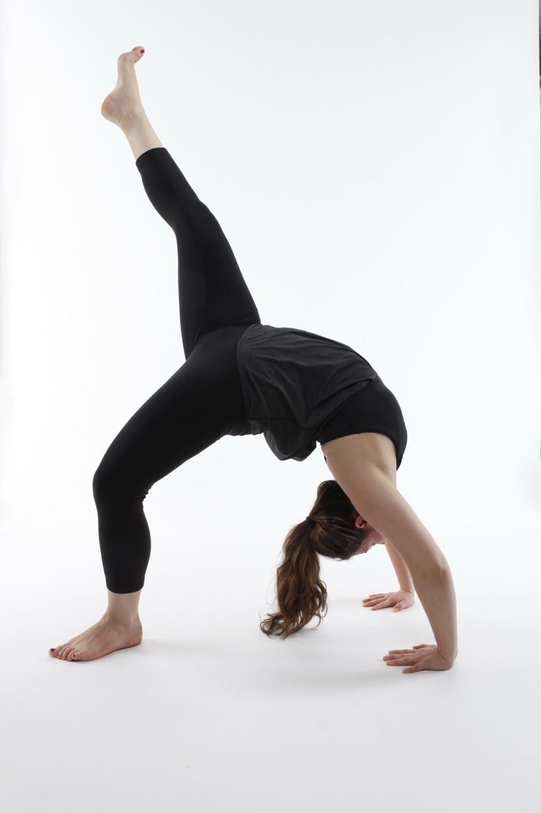

# Eka Pada Urdhva Dhanurasana

[TOC]

**Eka Pada Urdhva Dhanurasana** is an Asana. It is translated as **One Legged Upward Bow** Pose from Sanskrit.
The name of this pose comes from **eka** meaning **one**, **pada** meaning **leg**, **urdhva** meaning **upward**, **dhanu** meaning **bow** and **asana** meaning **posture** or **seat**.

## Technique
1. Keep the trend of extending the leg out but coming into One-Legged Bridge. Place your hands to your low back for extra support.
1. While in Urdhva Dhanurasana, inhale and extend the left leg upwards raising it off the floor balancing the body on right foot and both the arms.
1. Here in Eka Pada Urdhva Dhanurasana, the chest and the diaphragm open up the most giving the back bend pose a great look.
1. Remain here as per the body comfort and if possible hold on for 3 breaths at least.

## Technique in pictures/animation
## Effects
* Increases feelings of self-love and compassion
* Energizes both body and mind
* Increases spinal flexibility
* Soothes anxiety and depression
* Promotes calm and serenity
* Increases mental alertness
* Improves balance

## Related Asanas
* [Urdhva Dhanurasana](../yoga/Urdhva_Dhanurasana.md)

## Special requisites
## Initial practice notes
## References

## External Links
* [Eka Pada Urdhva Dhanurasana on yogajournal.com](https://www.yogajournal.com/practice/eka-pada-urdvha-dhanurasana)
* [Eka Pada Urdhva Dhanurasana on doyouyoga.com](https://www.doyouyoga.com/building-up-to-one-legged-wheel-pose-10183/)

## References

1. ["Methodology"](https://www.tummee.com/yoga-poses/eka-pada-urdhva-dhanurasana/steps)
2. [benefits"]("Health)(https://www.yogapedia.com/definition/7884/eka-pada-urdhva-dhanurasana)
