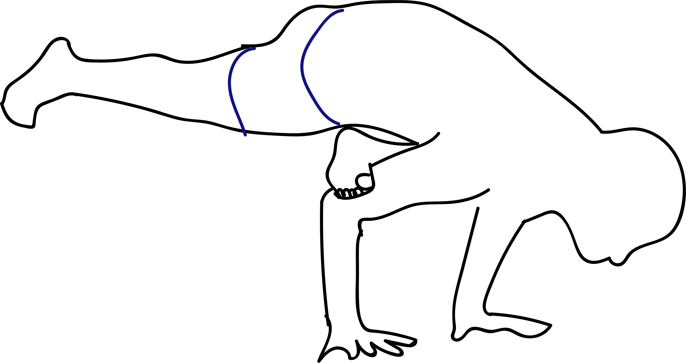

# Ekapada Galavasana

[TOC]

**Eka Pada Galavasana** is an Asana. It is translated as Pose Dedicated to Galava - One Legged Variation from Sanskrit. The name of this pose comes from **eka** meaning **one**, **pada** meaning **leg**, **Galava** in reference to a Hindu Sage, and **asana** meaning **posture** or **seat**.

## Technique
1. Start from Tadasana
1. Bend your left leg and place your left foot just above your right knee
1. Place your hands in prayer pose in front of your chest.
1. Bend forward, placing your under arms – with your hands still in prayer – on your left shine
1. Bend your right leg, sinking your pelvis to the floor until your right thigh is parallel to the floor
1. Stay here for one breath
1. Place your hands in front of you on the floor with your arms bend
1. Place your left shin on top of your arms. Hook your foot around your upper arm. The big trick is in this foot
1. Slowly bring your weight forward. Start tip towing on your right foot and when you’re ready shift your weight forward, lifting the right foot up; using your upper body and head as counter balance
1. If you find your balance slowly start extending your left leg to reach the full position

## Technique in pictures/animation
## Effects
* Calms the mind.
* Improves mental focus.
* Strengthens the wrists, arms and shoulders.
* Improves core strength.
* Improves overall sense of balance.
* Increases flexibility.

## Related Asanas
* [Chaturanga Dandasana](../yoga/Chaturanga_Dandasana.md)
* [Adho Mukha Svanasana](../yoga/Adho_Mukha_Svanasana.md)

## Special requisites
* Do not attempt this pose if you are a beginner. Perform it under expert guidance and after consulting your physician, especially if you suffer from any chronic back or leg injury or other medical condition.

## Initial practice notes
If you're not at the point where this pose makes sense, doing a few preparatory poses instead. Flying crow requires the hip flexibility of pigeon and the balance technique of crow, so these are two poses to focus on. Mastering crow, in particular, is the key to many more advanced arm balances. You really have to figure out how to get both feet off the floor without tipping forward before you can move on.

## References

## External Links
* [Eka Pada Galavasana on yogajournal.com](https://www.yogajournal.com/poses/flight-club)
* [Eka Pada Galavasana on beyogi.com](https://beyogi.com/learn-yoga/poses/flying-crow-pose/)
* [Eka Pada Galavasana on yogapedia.com](https://www.yogapedia.com/definition/8025/eka-pada-galavasana)

## References

1. ["Methodology"](https://dutchsmilingyogi.com/eka-pada-galavasana-flying-pigeon/)
2. [tips"]("Beginers)(https://www.verywellfit.com/flying-crow-pose-eka-pada-galavasana-3567077)
3. ["Benefits"](https://365dayspact.wordpress.com/2017/04/08/eka-pada-galavasana-flying-pigeon-pose-believe-in-yourself/)
