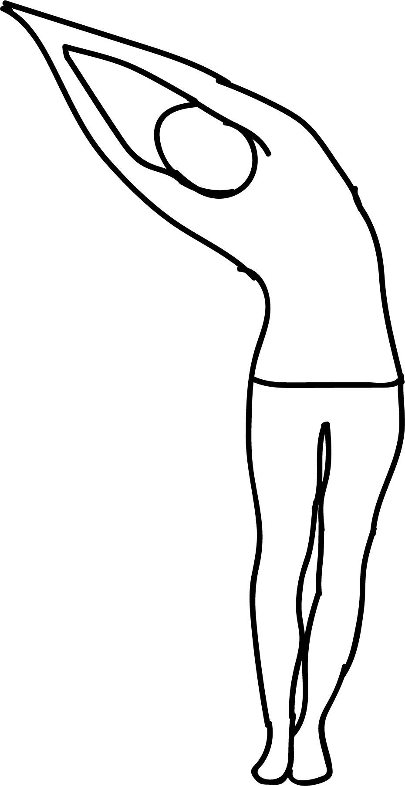

# Ekapada Indudalasana

[TOC]

**Eka Pada Indudalasana** is an Asana. It is translated as One Legged Standing Crescent Pose from Sanskrit. The name of this pose comes from **eka** meaning **one**, **pada** meaning **leg**, **indudala** meaning **crescent**, and **asana** meaning **posture** or **seat**. This pose is a variation of Indudalasana.

## Technique
1. Begin with Tadasana / Mountain Pose.
1. Inhale and move your arms towards the ceiling while expanding your upper ribs.
1. Join your palms and keep your back straight.
1. Exhale and bend towards your right without disturbing your lower body.
1. Feel the stretch on the left side of your body.
1. Gaze forward and maintain your balance.
1. Inhale and lift your left leg sideways out and up.
1. Stay in this pose for 3 long breaths.
1. Exhale and bring your left leg down.
1. Inhale and come into Tadasana / Mountain Pose.
1. Exhale and repeat the posture on your left side.

## Technique in pictures/animation
## Effects
* Reduces stress and fatigue.
* Stretches the sides, shoulders, arms and spine.
* Strengthens the abdominal muscles.
* Tones your the oblique muscles.
* Improves digestion.
* Improves flexibility and balance.
* Improves blood circulation.

## Related Asanas
* [Adho Mukha Svanasana](../yoga/Adho_Mukha_Svanasana.md)

## Special requisites
* Anyone suffering from severe lower back, shoulder or neck injuries.
* Anyone suffering from headache or heart problems.

## Initial practice notes
## References

## External Links
* [Eka Pada Indudalasana on 365dayspact.wordpress.com](https://365dayspact.wordpress.com/2017/04/15/eka-pada-indudalasana-one-legged-crescent-pose-tone-your-oblique-muscles/)

## References

1. ["Methodology"](https://365dayspact.wordpress.com/2017/04/15/eka-pada-indudalasana-one-legged-crescent-pose-tone-your-oblique-muscles/)
2. [benefits"]("Health)(https://365dayspact.wordpress.com/2017/04/15/eka-pada-indudalasana-one-legged-crescent-pose-tone-your-oblique-muscles/)
