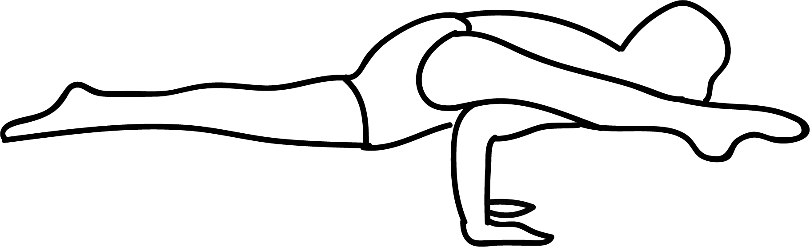

# Ekapada Koundinyasana I

[TOC]

**Eka Pada Koundinyasana I** (IPA: [eːkɐ pɐd̪ɐ koːund̪inɟɑːsɐnɐ]; Sanskrit: एक पद कोउन्दिन्यासन; IAST: eka pada koundinyāsana I) one-legged Sage Koundinya's pose is an asana.

## Technique
1. Start with the standing position or Tadasana. Then come into a squat with thighs pressing together, sitting on the toes of the feet.
1. Twist towards the left and place both the hands on the floor. The right hand will be touching the left leg above the knees.
1. Lean forward towards the left and try to lift yourself off the floor by using both the hands. This is same as the twisted Bakasana. From this position we can move on to the Eka Pada Koundinyasana.
1. Take the left leg backwards and at the same time move the right leg forward and let it rest on top of the right hand elbow. (Now, doing this may be difficult. Hence, one can try first keeping the left leg straight pointing out and the right leg backwards, straight in line with the body. From here, in a single step flip the left leg back and the right leg forward.)
1. This is the final pose. The right leg is pointing outwards towards right and the left leg is straight in line with the body. The left hand and elbow is free, just balancing the weight of the body.
1. Remain in the final position for as long as you are comfortable. In the final pose, one can hold the breath or can take very slow shallow breaths.
1. To release the pose, lower the left leg and let it touch the floor. At the same time the right leg can be bent and lowered to touch the floor. From here come back to the squat position.
1. This can be repeated on the other side also.

## Technique in pictures/animation
## Effects
* The pressure of the legs on the abdomen in this asana massages the abdominal organs.
* The spinal twist strengthens and rejuvenates the spine.
* Strengthens arms and neck.

## Related Asanas
* [Adho Mukha Svanasana](../yoga/Adho_Mukha_Svanasana.md)

## Special requisites
* Those suffering from any injury of arms, wrist or shoulders should avoid this asana.

## Initial practice notes
Eka Pada Koundinyasana is an advance posture and should not be attempted by beginners. One requires good strength of the arms and wrists and a great sense of balance to achieve it

## References

## External Links
* [Eka Pada Koundinyasana I on jasonyoga.com](http://www.jasonyoga.com/2016/03/11/eka-pada-koundinyasana-i/)
* [Eka Pada Koundinyasana I on asanajournal.com](https://www.asanajournal.com/eka-pada-koundinyasana-one-legged-pose-dedicated-to-sage-koundinya/)
* [Eka Pada Koundinyasana I on yogapaws.com](https://www.yogapaws.com/products/eka-pada-koundinyasana-i)

## References

1. ["Methodology"](http://www.yogicwayoflife.com/eka-pada-koundinyasana/)
2. [tips"]("Beginers)(http://www.yogicwayoflife.com/eka-pada-koundinyasana/)
3. [benefits"]("Health)(https://en.wikipedia.org/wiki/Eka_Pada_Koundinyasana_I)
