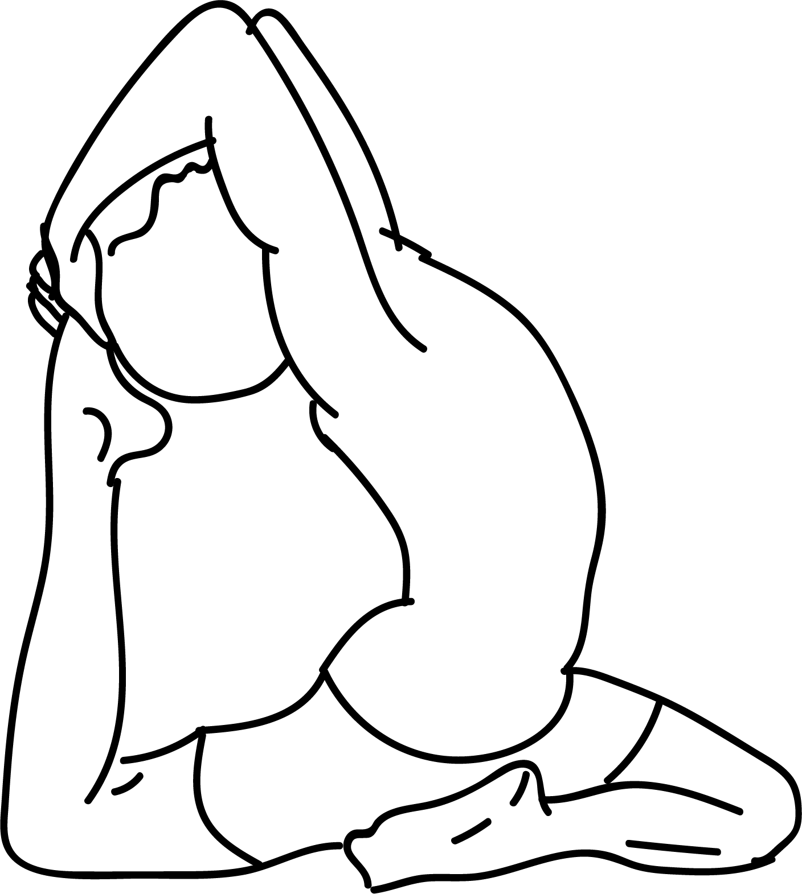

# Ekapada RajaKapotasana I

[TOC]

**Eka Pada RajaKapotasana I**' is an Asana. It is translated as One Legged King Pigeon Pose I from Sanskrit. The name of this pose comes from **eka** meaning **one**, **pada** meaning **leg** or **foot**, **raja** meaning **king** or **royal**, **kapota** meaning **pigeon**, and **asana** meaning **posture** or **seat**.

## Technique
1. Begin off on your fours, ensuring your knees are set directly under your hips and your hands somewhat in front of your shoulders.
1. After that tenderly slide your right knee forward, with the end goal that it is simply behind your right wrist. During this, keep your right shin under your torso, and acquire your right foot front of your left knee. The exterior of your right shin must lie on the floor.rajakapotasana-king-pigeon-pose-steps
1. Gradually, slide your left leg to the back. Rectify your knee, and drop the front of your thighs to the floor. Bring down the exterior of your right backside on the floor. Place your right heels before your left hip.
1. You can also point your right knee towards the right, to such an extent that it is outside the line of the hip.
1. Your left leg ought to broaden itself straight out of the hip. Ensure it is not turned or bent to your left side. Now rotate it inwards, with the end goal that its midline is squeezed against the floor.
1. After that, take a long and deep breath; while you breathe out bend left leg from the knees. At that point, push your middle back and extend as much as you can so that your head touches your foot, raise your arms, tenderly collapsing them at your elbows. Utilize your hands to bring your foot towards your head.
1. Keep up the upright position of your pelvis. Push it down. At that point, lift the lower edges of your rib confine against the weight of the push.
1. For lifting up your mid-section (Chest), push the highest point of your sternum straight up and towards the roof.
1. Remain in this position around 30 to 60 seconds.
1. Now put down your hands back to the floor and put your left knee down. Slowly slide your left knee forward, breathe out and get into the Adho Mukha Svanasana.
1. Rest for sometime; returned on your fours and relax. As you breathe out, do the asana with your left leg forward and right leg at the back.
1. Repeat this process with your right leg forward and once with your left leg forward.

## Technique in pictures/animation
## Effects
* Opens the hip joint, lengthens the hip flexor
* Stretches the thighs, gluteals and piriformis muscles, extends the groin and psoas
* Helps with urinary disorder, stimulates the internal organs
* Increases hip flexibility, improves posture, alignment, and overall suppleness
* Lessens or alleviates sciatic pain, diminishes lower back pain and stiffness
* It is a primal reaction to store stress, trauma, fear and anxiety in the hips, these bottled up feelings create tight hips.
* Pigeon Pose opens the hips and releases negative feelings and undesirable energy stored in your system.

## Related Asanas
* [Baddha Konasana](Baddha_Konasana.md)
* [Bhujangasana](../yoga/Bhujangasana.md)
* [Gomukhasana](../yoga/Gomukhasana.md)
* [Setu Bandhasana](../yoga/Setu_Bandhasana.md)
* [Supta Virasana](../yoga/Supta_Virasana.md)

## Special requisites
The people who all are suffering from followng injuries dont do this pose:

* Sacroiliac injury
* Ankle injury
* Knee injury
* Tight hips or thighs

## Initial practice notes
At first many students who learn this pose aren't able to easily grasp the back foot directly with their hands. Take a strap with a buckle. Slip a small loop over the back foot—let's say the left foot is extended back—and tighten the strap around the ball of the foot.

## References

## External Links
* [Eka Pada RajaKapotasana I on stylecraze.com](http://www.stylecraze.com/articles/rajakapotasana-king-pigeon-pose/#PreparatoryPoses)
* [Eka Pada RajaKapotasana I on harmonyyoga.com](http://harmonyyoga.com/article-1)
* [Eka Pada RajaKapotasana I on boldsky.com](https://www.boldsky.com/health/wellness/2016/eka-pada-rajakapotasana-to-improve-flexibility-of-hip-muscles-102692.html)

## References

1. ["Methodology"](https://www.sarvyoga.com/rajakapotasana-king-pigeon-pose-steps-and-benefits/)
2. [tips"]("Beginers)(https://www.yogajournal.com/poses/one-legged-king-pigeon-pose)
3. ["Benefits"](https://arogyayogaschool.com/blog/health-benefits-pigeon-pose-eka-pada-rajakapotasana/)
