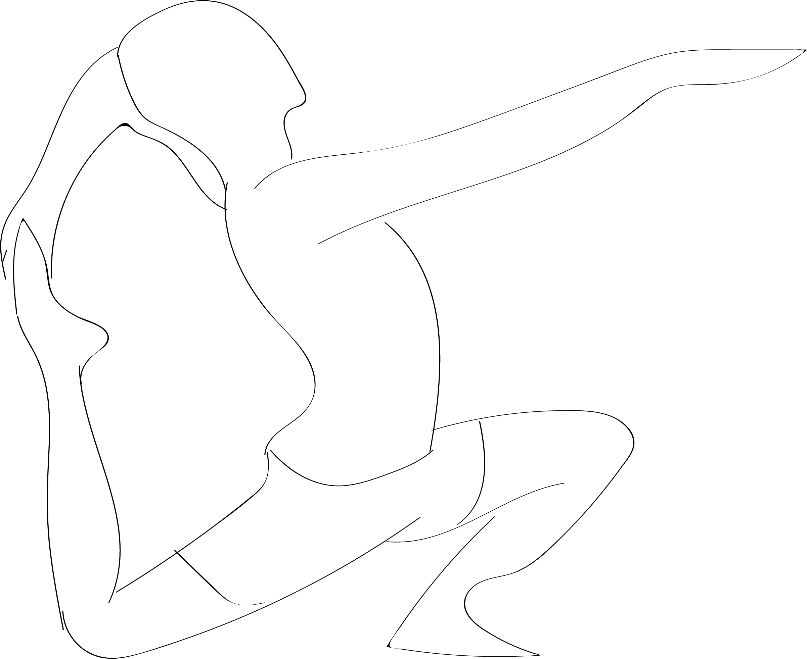

# Ekapada Rajakapotasana II

[TOC]

**Eka Pada Rajakapotasana II** is an Asana. It is translated as One Legged King Pigeon Pose II from Sanskrit. The name of this pose comes from **eka** meaning **one**, **pada** meaning **foot**, **raja** meaning **royal, king**, **kapota** meaning **pigeon**, and **asana** meaning **posture** or **seat**.

This pose is a variation of Eka Pada Rajakapotasana I.

## Technique
1. Start with low lunge with right leg forward and foot flat and grounded, left leg back with shin on floor.
1. Bend the left knee and reach the back with left arm to hold foot from the tip.
1. Relax the left hip, rotate left arm over left shoulder.
1. Firming core to protect back, and reaching over with right arm to hold left foot.
1. Allow the head to face upward.
1. Hold pose 3 to 7 breaths or as long as comfortable
1. Do all of the above steps with the opposite side.

## Technique in pictures/animation
## Effects
* It helps to open the hips.
* It also helps to increase the balance your core.
* It has a soothing effect on your mind and helps to calm it down.
* It stretches your thighs, psoas or hip flexors and groins and keeps them healthy and strong.
* It is also beneficial for the shoulders and chest as it helps to open them and keeps them strong and flexible.
* It helps to lengthen and release the back muscles through a gentle twist.
* It helps to strengthen and tone the standing arm and leg.
* It is beneficial for the quadriceps of the leg behind you as it stretches them and keeps them in shape..

## Related Asanas
* [Baddha Konasana](Baddha_Konasana.md)
* [Bhujangasana](../yoga/Bhujangasana.md)
* [Dhanurasana](../yoga/Dhanurasana.md)

## Special requisites
People with the following problem please avoid practising this pose, or practise under the expert’s supervisions and doctor’s advice.

* Neck Injuries
* Migraine
* Knee injury
* Tight hips or thighs
* Ankle injury
* Insomnia
* Meniscus or ligament injury.
* Shoulder dislocation
* Pregnant women

## Initial practice notes
In the beginning it can be tough for some people as this pose requires a lot of strength and flexibility. to make it easy you can keep the right foot close to your left hop or even place it under your right buttock so as to keep your lower leg parallel to your extended leg.

## References

## External Links
* [Eka Pada Rajakapotasana II on yogajournal.com](https://www.yogajournal.com/poses/eka-pada-rajakapotasana-ii)
* [Eka Pada Rajakapotasana II on harmonyyoga.com](http://harmonyyoga.com/article-1)
* [Eka Pada Rajakapotasana II on tummee.com](https://www.tummee.com/yoga-poses/eka-pada-rajakapotasana-ii)

## References

1. ["Methodology"](https://www.yogaasan.com/ekapadarajakapotasana-ii-one-legged-king-pigeon-pose-ii/)
2. [tips"]("Beginers)(https://www.yogajournal.com/poses/prep-poses-eka-pada-rajakapotasana-ii#gid=ci0207568df0202620&pid=carrie_wheel_pose_leg_lift)
3. ["Benefits"](http://www.astrolika.com/yoga/eka-pada-rajakapotasana-ii.html)
