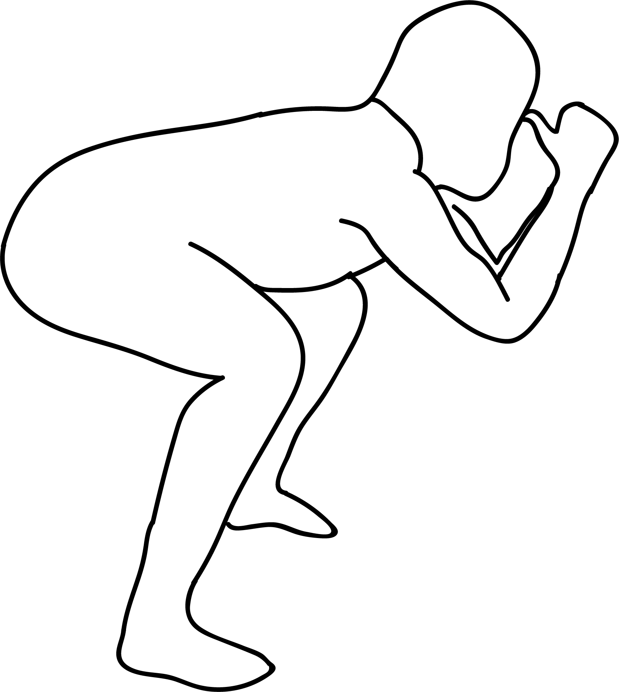

# Gaja Vadivu

[TOC]

**Gaja Vadivu** is an Asana. It is translated as Elephant Old Form from Sanskrit.

## Technique
1. Stand straight with your feet shoulder width apart.
1. Exhale and squat keeping your feet flat on the floor. If you are not able to squat, then use a wall to support your body’s weight and push your hips slowly towards the floor. You can also place your hands on a 2 feet tall chair/table and slowly bend your knees forming a right angle.
1. Inhale and lift your arms up. Join your palms in Pranam Mudra and gaze softly between your hands.
1. Exhale and slowly bring your palms towards the floor, while holding the Pranam Mudra. Make your torso parallel to the floor, point your fingers are towards the ceiling.
1. Inhale and bring your palms together at the center of your forehead.
1. Touch your elbows together and curls your fingers in such a manner that your knuckles point upwards.
1. Touch the tip of your thumbs to your forehead.
1. Focus in between your eyebrows and stay in this pose for 3 to 6 long breaths.

## Technique in pictures/animation
## Effects
* Improves focus and concentration.
* Regulates hormonal balance.
* Recommended for pregnant women.
* Improves metabolism.
* Combats stomach problems like constipation and gas.
* Stretches and strengthens the feet, ankles, calves, hips, and spine.
* Tones the abdomen.

## Related Asanas
* [Adho Mukha Svanasana](../yoga/Adho_Mukha_Svanasana.md)

## Special requisites
* Anyone suffering from severe knee, back, hip or stomach injuries.

## Initial practice notes
* If you find it difficult to hold your feet, use a yoga strap by looping it around the middle arch.
* When you do this asana, you might let your tailbone arch towards the ceiling. But you have to make sure your tailbone is pressed to the floor. Only then, the hips flexibility will increase.

## References

## External Links
* [Gaja Vadivu on tummee.com](https://www.tummee.com/yoga-poses/gaja-vadivu)

## References

1. ["Methodology"](https://365dayspact.wordpress.com/2017/07/16/gaja-vadivu-elephant-pose-cultivate-physical-mental-stability/)
2. [tips"]("Beginers)(http://www.stylecraze.com/articles/ananda-balasana-benefits/#BeginnersTips)
3. [benefits"]("Health)(https://365dayspact.wordpress.com/2017/07/16/gaja-vadivu-elephant-pose-cultivate-physical-mental-stability/)
