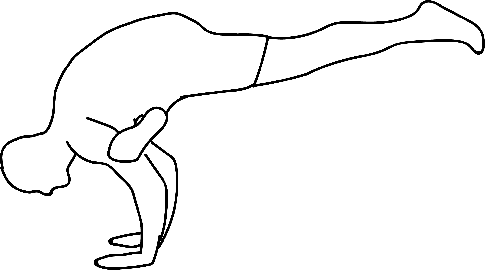

# Galavasana

[TOC]

**Galavasana** is an Asana. It is translated as Pose Dedicated to Galava from Sanskrit. The name of this pose comes from **Galava** referring to sage Galava, and **asana** meaning **posture** or **seat**.

## Technique
1. Begin with Utkatasana / Chair Pose.
1. Place your right foot on top of your left knee in such a way that your right shin is parallel to the floor.
1. Exhale and bend forward.
1. Place your palms on the floor about 6 inches in front of you.
1. Bend your elbows and place your right knee on your right triceps. Hook you right foot around your left triceps.
1. Inhale and move your torso forward.
1. Bend your left knee and lift your left foot off the ground.
1. Activate your core and push your left leg further up.
1. Don’t bring your shoulders below your elbow height.
1. Gaze forward or towards the floor.
1. Stay in this pose for as long as you can.

## Technique in pictures/animation
## Effects
* Strengthens the wrists and arms
* Massage for the abdominal organs
* Increases sense of balance
* Calms the mind by relieving stress and anxiety

## Related Asanas
* [Virabhadrasana II](../yoga/Virabhadrasana_II.md)
* [Garudasana](../yoga/Garudasana.md)

## Special requisites
The people suffering from below listed injuries should avoid this pose:

* Anyone with high or low blood pressure.
* Anyone suffering from severe lower back, hip, shoulder or wrist injuries.
* Avoid during pregnancy.

## Initial practice notes
* If you're not at the point where this pose makes sense, doing a few preparatory poses instead.

## References

## External Links
* [Galavasana on yogapedia.com](https://www.yogapedia.com/definition/8025/eka-pada-galavasana)
* [Galavasana on jaisiyaram.com/](http://www.jaisiyaram.com/yoga-poses/eka-pada-galavasana.html)
* [Galavasana on yogajournal.com](https://www.yogajournal.com/poses/flight-club)

## References

1. ["Methodology"](https://365dayspact.wordpress.com/2017/04/08/eka-pada-galavasana-flying-pigeon-pose-believe-in-yourself/)
2. [tips"]("Beginers)(https://www.verywellfit.com/flying-crow-pose-eka-pada-galavasana-3567077)
3. [benefits"]("Health)(https://dutchsmilingyogi.com/eka-pada-galavasana-flying-pigeon/)
