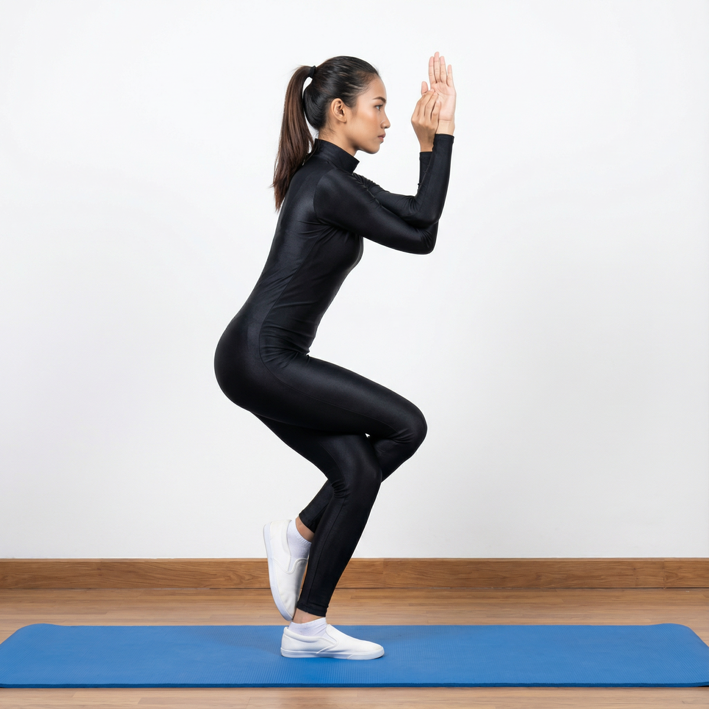

# Garudasana

[TOC]

**Garuda** is the Sanskrit term for eagle. Indian mythology suggests that Garuda was the king of all birds. This bird not only served as the vehicle of Lord Vishnu but was also a frontrunner when it came to fighting against demons. Garuda also means devour.

## Technique
1. Slightly bend your knees, lift your left leg balancing the body on the right leg. Place the left thigh over the right thigh.
1. Wrap the shin of your left leg around the calf of the right leg. Hook the top of the left foot in the lower right calf. Balance the body on right leg.
1. Raise the arms in front and parallel to the floor, palms facing upward direction. Next, cross your arms placing the right arm above the left arm.
1. Bend the elbows making the forearms perpendicular to the floor. Wrap the left forearm around and under the right forearm. Rest your left hand’s fingers firmly on your right palm. Keep the spine erect.
1. Focus your gaze at a fixed point at a distance of 4-5 feet away. This is the final position. Hold the pose for 15 to 20 seconds taking deep breaths.
1. To return, gently release the arms first and then the legs to come back in starting position. Take 3 deep and long breaths, practice from the other side by interchanging the position of legs and arms.

## Technique in pictures/animation
## Effects
* Stretches the hips, thighs, shoulders and upper back.
* Improves balance.
* Strengthens the calves.
* Helps alleviate sciatica and rheumatism.
* Loosens the legs and hips, making them more flexible.

## Related Asanas
* [Adho Mukha Svanasana](../yoga/Adho_Mukha_Svanasana.md)
* [Gomukhasana](../yoga/Gomukhasana.md)
* [Prasarita Padottanasana](../yoga/Prasarita_Padottanasana.md)
* [Supta Virasana](../yoga/Supta_Virasana.md)
* [Supta Baddha Konasana](../yoga/Supta_Baddha_Konasana.md)
* [Upavistha Konasana](../yoga/Upavistha_Konasana.md)
* [Virasana](../yoga/Virasana.md)

## Special requisites
It is essential to practice this pose correctly to avoid injury.

* Avoid practicing Garudasana in case you have had a recent knee, ankle or shoulder injury.
* Eagle pose should not be attempted if you suffer from any of these conditions: Obesity, frequent headaches, high or low blood pressure or asthma.
* Pregnant women must avoid practicing Eagle Pose as well.

## Initial practice notes
As beginners, you might find it difficult to tangle your arms around each other. To make it easier, stretch your arms out, such that they are parallel to the floor. Hold onto the ends of a strap. Now, as you hold on to the strap tightly, try and wrap your hands into position.

## References

## External Links
* [Garudasana on yogajournal.com](https://www.yogajournal.com/poses/eagle-pose)
* [Garudasana on easyayurveda.com](https://easyayurveda.com/2018/03/25/garudasana-eagle-pose/)
* [Garudasana on stylesatlife.com](http://stylesatlife.com/articles/garudasana-eagle-pose/)

## References

1. ["Methodology"](http://www.finessyoga.com/yoga-asanas/garudasana-eagle-pose-steps-benefits)
2. [tips"]("Beginers)(http://www.stylecraze.com/articles/garudasana-eagle-pose/#Beginner’sTips)
3. [benefits"]("Health)(https://www.artofliving.org/in-en/yoga/yoga-poses/garudasana-eagle-pose)
