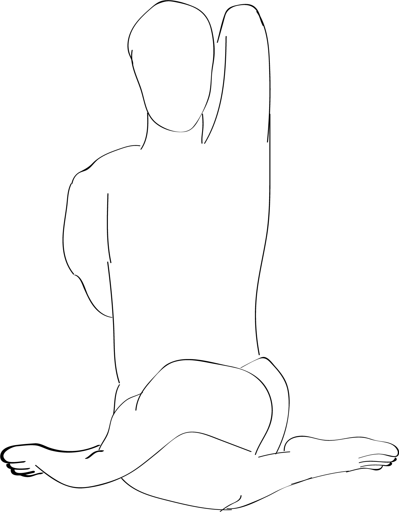

# Gitanandasana

[TOC]

This pose is dedicated to Yogamaharishi Dr. Swami Gitananda Giri, a modern yogi born in 1907 and is one of the most recognized modern yogis of our time. Yogi Gitananda is also credited with bringing yoga to the Western world in the 1950s. He received many recognitions and awards during his time, one of it being hailed as the Father of Scientific Yoga.

## Technique
## Technique in pictures/animation
## Effects
* Hatha yoga boosts overall health.
* Tones the spine.
* Improves flexibility.
* Strengthens muscles.
* Enhances balance.
* Revs up blood circulation.
* Increases immunity.
* Relieves stress.
* Helps with focus and concentration.
* Balances the flow of energy.
* Makes you happy.

## Related Asanas
* [Adho Mukha Svanasana](../yoga/Adho_Mukha_Svanasana.md)

## Special requisites
## Initial practice notes
## References

## External Links
* [Gitanandasana on artofliving.org](https://www.artofliving.org/in-en/yoga/hatha-yoga)

## References

1. [benefits"]("Health)(https://www.artofliving.org/in-en/yoga/hatha-yoga)
