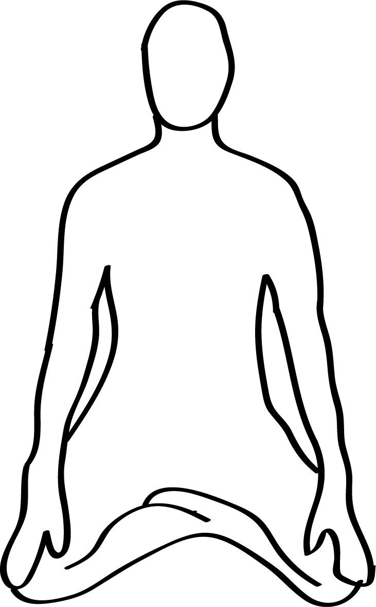

# Guptasana

[TOC]

**Guptasana** also known as Siddhasana is an Asana. It is translated as Hidden Pose from Sanskrit. In the world of yoga, there are numerous poses that seems to be simple but are quite powerful. Among such poses, one of them is the 'Perfect pose' or 'Adept's pose'. In Sanskrit, this pose is also well known as 'Siddhasana' or 'Guptasana'. It is to be mentioned that Guptasana is oldest, seated yoga form that has been conventionally used since long period for the purpose of meditations and breathing exercises.

## Technique
1. Initially you are required to sit down on the floor and keep your legs stretched and spine straight. Your arms must rest at the sides. This pose is known as Dandasana
1. By tilting your left knee, you take your left heel towards the groin area. Your heels would rest on the perineum which is the area at the base of spine in between the anus and genitals
1. Similarly, tilt your right leg and take your right heel inside. You are then required to keep your right ankle over the inner ankle of the left foot. # Place your right heel over the pubic bone
1. You can keep your hands over the thighs and face your palms facing upward
1. Your spine needs to be straight
1. You are then supposed to close your eyes slowly and gaze inward
1. You can remain in this pose for around one minute or till the time you are meditating or in pranayama practice
1. You can come out of this pose by stretching your legs in the floor in Staff pose. You are then required to rest yourself in Corpse pose for five minutes

## Technique in pictures/animation
## Effects
* Sit erect with your legs folded, with one heel placed just above the penis and the other heel is placed just over it.
* Place the hands on the knees.
* Press the chin against the chest and concentrate your gaze towards the center of your eyebrows as in Shambavi Mudra or you may keep the head straight without bending with your eyes closed for meditation.

## Related Asanas
* [Padmasana](../yoga/Padmasana.md)

## Special requisites
It is advisable not to perform this pose in case you have any form of physical problems. A person having any form of surgeries in their back or hip cannot perform this pose. A person suffering from pain in their lower back and has problem of sciatica must not practice this pose. Those suffering from knee pain or knee injuries must not perform this pose at all.

## Initial practice notes
Although there is no beginner's tip for such an easy pose, but some of the beginner's tend to keep a piece of cloth inside their locked ankles in order to make them slope slightly downwards.

## References

## External Links
* [Guptasana on stylesatlife.com](http://stylesatlife.com/articles/guptasana/)
* [Guptasana on yogafaculty.com](http://www.yogafaculty.com/guptasana/)
* [Guptasana on herbalcureindia.com](http://www.herbalcureindia.com/yoga-journal/sidhasana.html)

## References

1. ["Methodology"](http://www.astrolika.com/yoga/guptasana.html)
2. [tips"]("Beginers)(http://www.astrolika.com/yoga/guptasana.html)
3. [benefits"]("Health)(http://yoga.omgyan.com/posture/Guptasana.html)
