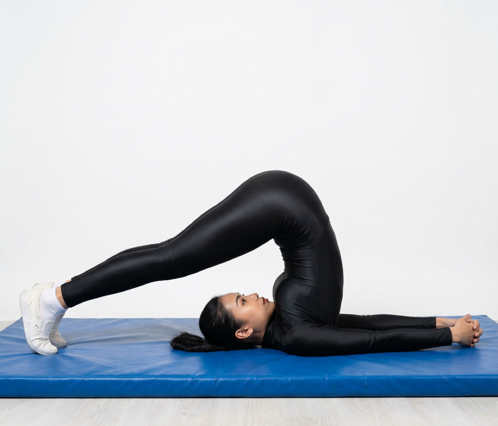

# Halasana

[TOC]

The Plough Pose, **Halasana** (pronounced ha-laa-suh-nuh) is derived from the Sanskrit word ‘hala’ which means ‘plough’. It is named so because the final pose resembles the plough, an agricultural equipment.

## Etymology
The name comes from the Sanskrit words hala (हला) meaning "plow" and asana (आसन) meaning "posture" or "seat".

## Technique
1. Lying on the floor in a supine position, with the arms alongside the body and palms facing down, bend the knees and kick and rock the legs up and back, bringing the bent knees to the forehead and placing the hands under the hips.
1. Slowly, as you exhale, straighten your knees to attain the proper posture. Keep your torso perpendicular to the floor and your legs fully extended.
1. Inhale, draw your chin away from your sternum and soften your throat opening up the shoulders and pressing into the ground with the upper arms to create lift.
1. To feel the complete benefits of the pose, move the legs as further from the head as possible. At this stage one achieves a chin lock. At this point pressure is put on the thyroid glands.
1. Interlace the fingers of your hands behind your back and gently squeeze the shoulder blades together. You may also slide the arms over your head and grab your toes.
1. Maintain the position and your breathing for 4-10 counts depending on your level of comfort.
1. Finally, exhale as you slowly and easily retrieve your legs from behind your back and place them perpendicular to the mat.
1. Return to supine position once again.
1. Repeat 3-4 times.

## Technique in pictures/animation
## Effects
* Strengthens and opens up the neck, shoulders, abs and back muscles.
* Stimulates the abdominal organs and thyroid gland.
* Calms the nervous system and reduces stress and fatigue.
* Helps relieve symptoms of menopause.
* Stimulates the thyroid gland and strengthens the immune system.
* Helps tone the legs and stretches out the shoulders and spine.

## Related Asanas
* [Salamba Sarvangasana](Salamba_Sarvangasana.md)
* [Setu Bandha Sarvangasana](../yoga/Setu_Bandha_Sarvangasana.md)

## Special requisites
Avoid Halasana if you have a back or neck injury or if you are menstruating or have diarrhea.

## Initial practice notes
As a beginner, you might overstretch your neck when you get into this asana. The goal must be to push down the tops of your shoulders to support your back and lift your shoulders a little towards your ear.

## References

## External Links
* [Halasana on eyogaguru.com](https://eyogaguru.com/halasana-plow-pose-yoga-benefits/)
* [https:https://www.yogajournal.com/poses/supported-shoulderstand//www.sarvyoga.com/halasana-plow-pose-steps-and-benefits/ Halasana on sarvyoga.com]
* [Halasana on food.ndtv.com](https://food.ndtv.com/health/halasana-the-miracle-pose-that-helps-reduce-blood-pressure-1418381)

## References

1. ["Methodology"](https://arogyayogaschool.com/blog/health-benefits-of-halasana-the-plough-pose-benefits/)
2. [tips"]("Beginers)(http://www.stylecraze.com/articles/halasana-plow-pose/#Beginner’sTip)
3. ["Benefits"](https://thehealthorange.com/stay-fit/yoga/how-to-do-halasana-plow-pose-in-7-steps-its-benefits/)
