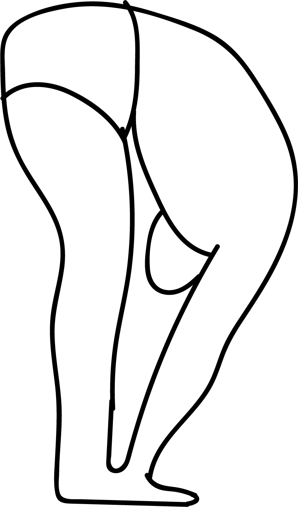

# Hasta Padasana 1

[TOC]

**Hasta Padasana 1** is an Asana. It is translated as Hands to Foot Pose 1 from Sanskrit. The name of this pose comes from **hasta** meaning **hand**, **pada** meaning **foot**, and **asana** meaning **posture** or **seat**.

## Technique
1. Stand straight with feet together and arms alongside the body.
1. Balance your weight equally on both feet.
1. Breathing in, extend your arms overhead.
1. Breathing out, bend forward and down towards the feet.
1. Stay in the posture for 20-30 seconds and continue to breath deeply.Hastapadasana Yoga Pose - Standing Forward Bend Yoga Pose
1. Keep the legs and spine erect; hands rest either on the floor, beside the feet or on the legs.
1. On the out breath, move the chest towards the knees; lift the hips and tailbone higher; press the heels down; let the head relax and move it gently towards the feet. Keep breathing deeply.
1. Breathing in, stretch your arms forward and up, slowly come up to the standing position.
1. Breathing out, bring the arms to the sides

## Technique in pictures/animation
## Effects
* The stretching positions of hastapadasana, helps to become your chest and hands stronger and gives very good shape to your body. It will make you beautiful and good-looking.
* All the disorders of belly and digestive system like constipation and other stomach ailments can be cured by doing this yoga daily.
* Diseases of the feet and fingers can be corrected with this yoga as it stimulates the blood circulation in fingers and feet.
* This yoga is very useful for stimulating your nervous system and increasing strength to your spine muscles.
* Hastapadasana is also inducing the blood circulation in the brain, which helps to prevent the loss of hair.
* This yoga posture is beneficial to relieve menstrual symptoms in women.
* your backbone will get much flexibility by doing this pose on daily basis.

## Related Asanas
* [Adho Mukha Svanasana](../yoga/Adho_Mukha_Svanasana.md)

## Special requisites
It is essential to practice this pose correctly to avoid injury:

* Back injury: People suffering from lower back injuries, Spondylitis, Cervical pain or any kind of back and spinal problems should not do this pose.

## Initial practice notes
* If you find it difficult to hold your feet, use a yoga strap by looping it around the middle arch.
* When you do this asana, you might let your tailbone arch towards the ceiling. But you have to make sure your tailbone is pressed to the floor. Only then, the hips flexibility will increase.

## References

## External Links
* [Hasta Padasana 1 on yogapedia.com](https://www.yogapedia.com/definition/6100/hasta-padasana)
* [Hasta Padasana 1 on cnyhealingarts.com](http://www.cnyhealingarts.com/2011/05/18/the-health-benefits-of-utthita-hasta-padasana-extended-hands-and-feet-pose/)
* [Hasta Padasana 1 on eyogaguru.com](https://eyogaguru.com/standing-forward-bend-yoga-pose-hastapadasana-steps-and-benefits/)

## References

1. ["Methodology"](https://www.artofliving.org/in-en/yoga/yoga-poses/standing-forward-bend-hastapadasana)
2. [tips"]("Beginers)(https://www.artofliving.org/in-en/yoga/yoga-poses/standing-forward-bend-hastapadasana)
3. [benefits"]("Health)(http://www.sweetadditions.net/health/benefits-of-hastapadasana-yoga-position)
