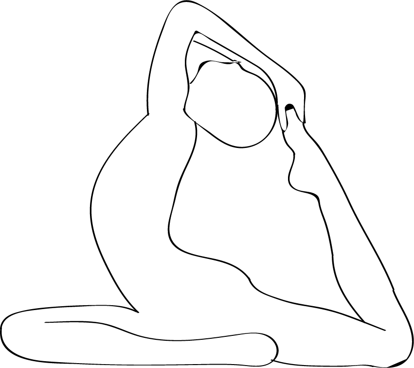

# Hatha yoga

[TOC]

**Hatha yoga** is also called Haṭha vidyā, is a branch of yoga. The word haṭha means force, Denotes a system of physical techniques supplementary to a broad conception of yoga. Hatha yoga is associated with the Dashanami Sampradaya and the mystical figure of Dattatreya.

In the 20th century, hatha yoga, particularly asanas (the physical postures), became popular throughout the world as a form of physical exercise, and is now colloquially termed as simply "yoga". **Haṭha yoga ** is the way towards realisation through rigorous disciplane.

## Practice
Hatha yoga has some important principles and practices that are shared with other methods of yoga, such as subtle physiology, dhāraṇā (fixation of the elements), and nādānusandhāna (concentration on the internal sound).

## Eight limbs
Hatha yoga consists of eight limbs focused on attaining samādhi. In this scheme, the six limbs of hatha yoga are defined as asana, pranayama, pratyahara, dharana, dhyana and samādhi. It includes disciplines, postures (asanas), purification procedures (shatkriya), gestures (mudras), breathing (pranayama), and meditation. The hatha yoga predominantly practiced in the West consists of mostly asanas understood as physical exercises. It is also recognized as a stress-reducing practice.

## Health benefits ascribed to yogāsana practice
Students in a Hatha Yoga class practising the reclining bound angle pose, sometimes called bound butterfly pose
Yoga's combined focus on mindfulness, breathing and physical movements brings health benefits with regular participation. Yoga participants report better sleep, increased energy levels and muscle tone, relief from muscle pain and stiffness, improved circulation and overall better general health. The breathing aspect of yoga can benefit heart rate and blood pressure.

* The 2012 "Yoga in America" survey, conducted by Harris Interactive on behalf of Yoga Journal, shows that the number of adult practitioners in the US is 20.4 million, or 8.7 percent. The survey reported that 44 percent of those not practicing yoga said they are interested in trying it

## References

## References

1. [Wikipedia](https://en.wikipedia.org/wiki/Hatha_yoga)
