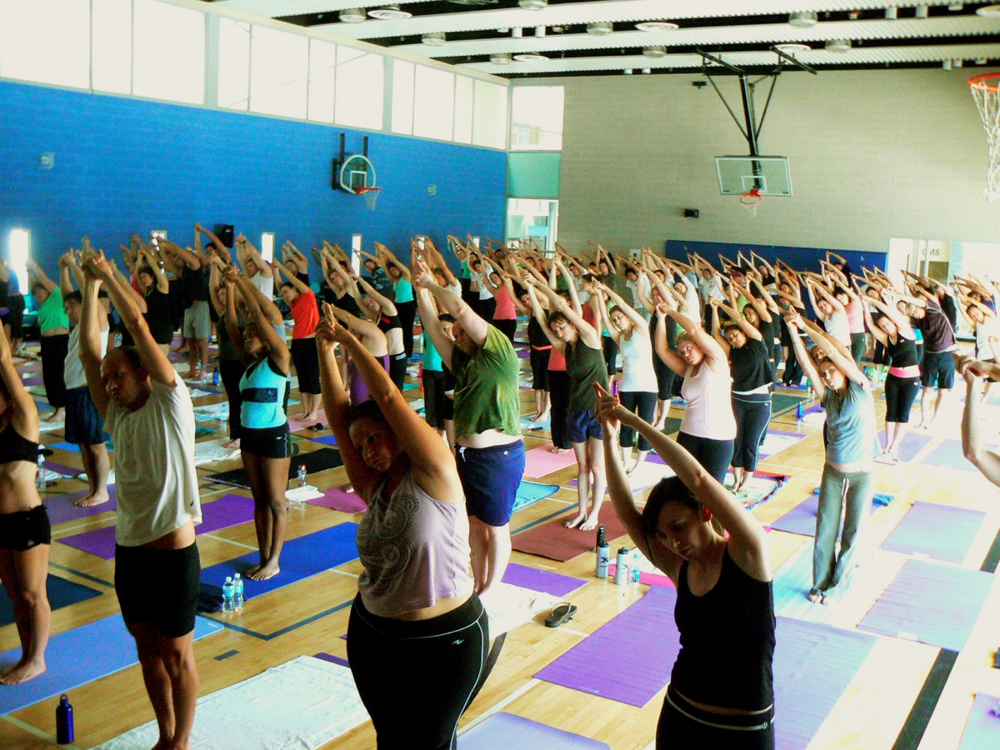

# Indudalasana

[TOC]

**Indudalasana is an Asana** It is translated as **Standing Crescent Pose** from Sanskrit. The name of this pose comes from "indudala" meaning "crescent",and "asana" meaning "posture" or "seat".

## Technique
1. Begin with Tadasana / Mountain Pose.
1. Inhale and move your arms towards the ceiling while expanding your upper ribs.
1. Join your palms and keep your back straight.
1. Exhale and bend towards your right without disturbing your lower body.
1. Feel the stretch on the left side of your body.
1. Gaze forward and maintain your balance.
1. Stay in this pose for 3 long breaths.
1. Inhale and come back up.
1. Exhale and repeat the posture on your left side.

## Technique in pictures/animation
## Effects
* Reduces stress and fatigue.
* Stretches the sides, shoulders, arms and spine.
* Strengthens the abdominal muscles.
* Improves digestion.
* Improves flexibility and balance.
* Improves blood circulation.

## Related Asanas
* [Adho Mukha Svanasana](../yoga/Adho_Mukha_Svanasana.md)

## Special requisites
It is essential to practice this pose correctly to avoid injury.

* Anyone suffering from severe lower back, shoulder or neck injuries.
* Anyone suffering from headache or heart problems.

## Initial practice notes
Beginners or those with limited balance and/or flexibility can practice indudalasana with the feet farther apart. Alternate hand positions include overhead in prayer position or the lower (in the direction of the bend) hand on the hip or on the thigh.

## References

## External Links
* [Indudalasana on yogajournal.com](https://www.yogajournal.com/practice/blueprint-for-change)
* [Indudalasana on yogapedia.com](https://www.yogapedia.com/definition/7439/indudalasana)
* [Indudalasana on ipfs.io](https://ipfs.io/ipfs/QmXoypizjW3WknFiJnKLwHCnL72vedxjQkDDP1mXWo6uco/wiki/Indudalasana.html)

## References

1. ["Methodology"](https://365dayspact.wordpress.com/2017/03/13/indudalasana-standing-crescent-moon-lose-your-love-handles/)
2. [tips"]("Beginers)(https://www.yogapedia.com/definition/7439/indudalasana)
3. [benefits"]("Health)(https://365dayspact.wordpress.com/2017/08/15/eka-hasta-parshvasana-one-hand-side-stretch-pose-lose-your-love-handles/)
