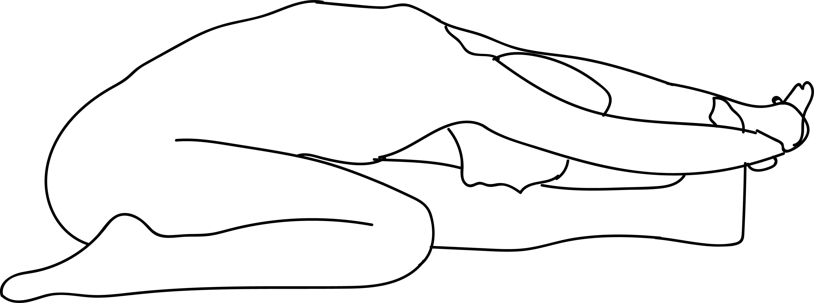

# Janu Sirsasana

[TOC]

**Janu Sirsasana** is an asana. It is part of the Ashtanga Yoga Primary Series and is commonly practiced as a seated asana in many styles of yoga.

## Technique
1. Sit straight with the legs stretched out in front of the body, keeping the feet together.
1. Bend the left knee and bring the left heel close to your groin as much as you can comfortably. Place the sole of the left foot to the inside of right leg’s inner thigh.
1. Keep the left knee on the floor. Place the palm of your hands on the top of the right knee.
1. Inhale and using your pelvic muscles, slowly bend the torso in the forward direction sliding your hands towards the right foot.
1. Try to get a hold of right foot if possible, else keep your hands as far as you can comfortably. Ideally, hands are locked behind the sole of the right foot, grabbing the left wrist with a right hand. It takes time to be able to bend to that extent.
1. Move your head towards your right leg, if possible touch your knee with your forehead.
1. Keep the back relaxed and don’t overstretch the body.
1. Retain the final position for a few seconds or as long as you feel comfortable, breathing normally.
1. To return, inhale and lift the head, release the hands and bring them back in upright position.
1. Take 3 long and deep breaths. Practice again by interchanging the position of the legs..

## Technique in pictures/animation
## Effects
* Increase flexibility in your spine, abdomen and back muscles.
* Relieves menstrual discomfort.
* Calms your mind and body.
* Releases stress and depression.
* Improve the function of the intestine. Boosts digestion.
* Improves the function of kidneys and liver.
* Stretches your back and legs.
* Strengthens stomach muscles and lose belly fat.
* Improves the function of the reproductive system.

## Related Asanas
* [Uttanasana](../yoga/Uttanasana.md)
* [Baddha Koṇāsana](Baddha_Koṇāsana.md)
* [Adho Mukha Svanasana](../yoga/Adho_Mukha_Svanasana.md)
* [Vriksasana](../yoga/Vriksasana.md)

## Special requisites
Avoid doing Head to Knee pose if you are suffering from

* Spondylosis
* Heart Disease
* High blood pressure
* Back pain
* Should avoid during pregnancy.

## Initial practice notes
* Make sure the bent-leg foot doesn't slide under the straight leg. You should be able to look down and see the sole of the foot.

## References

## External Links
* [Janusirsasana on spotebi.com](https://www.spotebi.com/exercise-guide/head-to-knee-forward-bend-pose/)
* [Janusirsasana on stylecraze.com/](http://www.stylecraze.com/articles/janu-sirsasana-head-to-knee-pose/#PreparatoryPoses)
* [Janusirsasana on yogajournal.com](https://www.yogajournal.com/poses/head-to-knee-forward-bend)

## References

1. ["Methodology"](http://www.finessyoga.com/yoga-asanas/janu-sirsasana-steps-benefits)
2. [tips"]("Beginers)(https://www.yogajournal.com/poses/head-to-knee-forward-bend)
3. [benefits"]("Health)(https://eyogaguru.com/janu-sirsasana-head-to-knee-pose-steps-and-benefits/)
