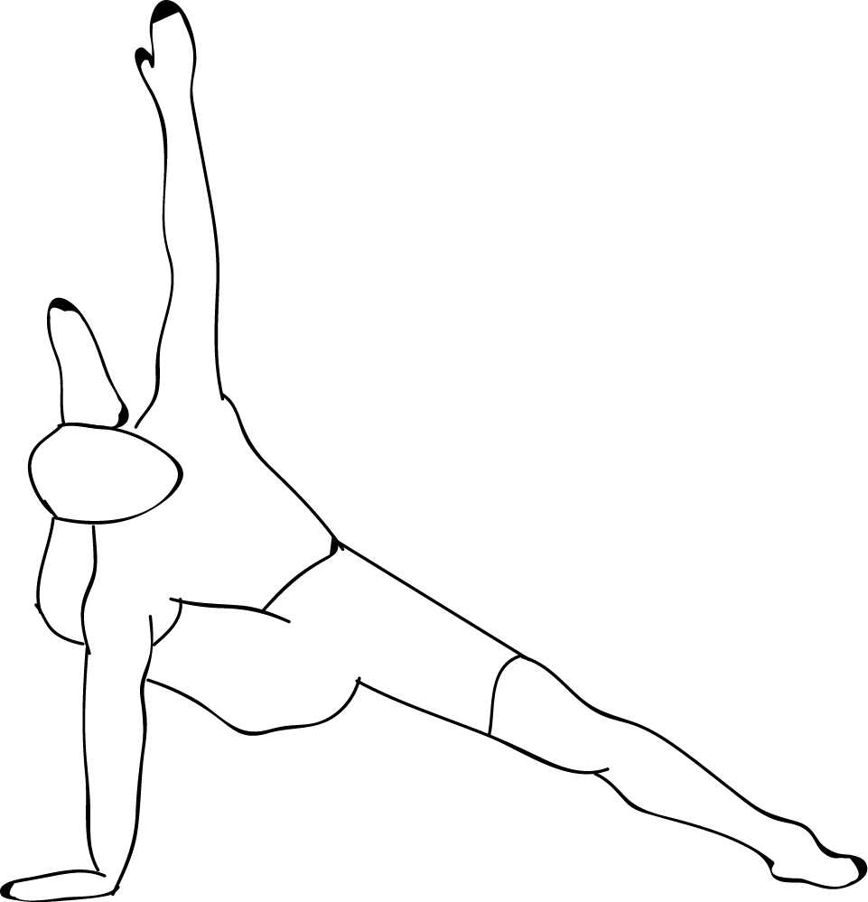

# Kala Bhairavasana

[TOC]

**Kala Bhairavasana** is an Asana. It is translated as Pose Dedicated to **Shiva the Destroyer** from Sanskrit.

The name of this pose comes from "Kala Bhairava" meaning "Shiva in His Most Formidable Form", and "asana" meaning "posture" or "seat".

## Benefits
1. It opens the inner hips and thighs
1. Stretches the hamstrings
1. Strengthens the wrist, elbow and shoulders, as well as the core.

## Cautions
* Be careful while doing this pose if you have any lower back, wrist, elbow, shoulder, spine, hip, knee or neck injuries.

## References

## References

1. ["wikipedia"](https://en.wikipedia.org/wiki/Kala_Bhairavasana)
