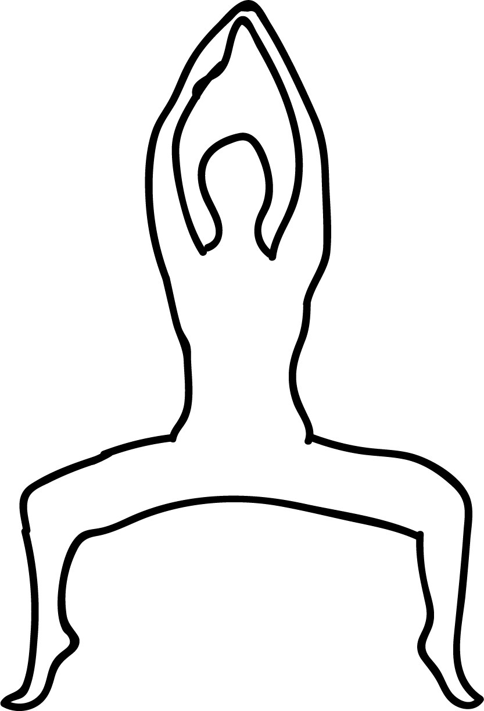

# Kalyasana

[TOC]

**Kalyasana** is an Asana. It is translated as Pose Dedicated to Goddess Kali from Sanskrit. It is also known as Utkata Konasana or Goddess Pose.
The name of this pose comes from "Kali" referring to a Hindu Goddess, and "asana" meaning "posture" or "seat".

## Benefits
1. It strengthens the leg muscles and glutes
1. Promotes the sense of balance.

## Cautions
* Be careful while doing this pose if balance is a concern or if you have any leg injuries.

## References

## References

1. ["wikipedia"](https://en.wikipedia.org/wiki/Kalyasana)
