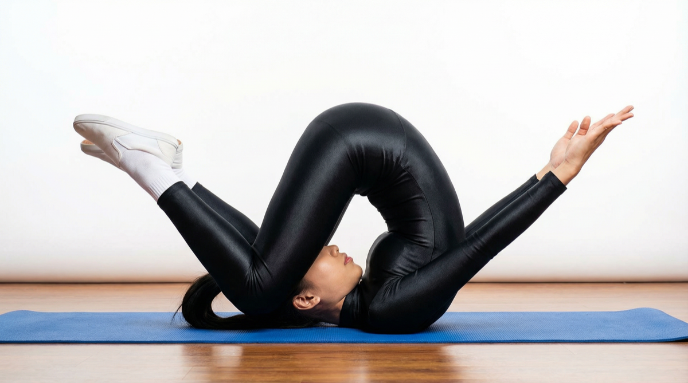

# Karnapidasana

[TOC]

Karnapidasana (ear pressure posture) is considered to be an intermediate to advanced posture, when the feet are on the floor. If you are new to this posture or new to yoga, but still want to give it a go; please only perform under the supervision of a qualified teacher, and come out of the posture if you feel ANY pain

## Technique
1. Begin in plow pose with the shoulders tucked under. Your hands can be flat on the floor or interlaced behind your back.
1. Bend your knees and bring them to the floor on either side of your head.
1. Rest the tops of your feet on the floor.
1. Allow the knees to apply light pressure to the ears, momentarily cutting off aural distractions.
1. Take at least five breaths before releasing your arms and slowly rolling out of the pose vertebra by vertebra.

## Technique in pictures/animation
## Effects
* Stretches and stengthens the whole spinal column
* Can gradually improve lung strength so can be benificial for asthma sufferers (but keep the feet on blocks.
* Stimulates the abdominal organs, and thyroid gland
* Stretches the shoulders and spine
* Controls hypertension
* Helps relieve the symptoms of menopause
* Reduces stress and fatigue and is good for calming the mind
* Can be used to treat insomnia, sinusitis, infertility, headache, and some types of backache

## Related Asanas
* [Adho Mukha Svanasana](../yoga/Adho_Mukha_Svanasana.md)

## Special requisites
Dont do this pose if you are having following:

* Diarrhoea
* Menstruation
* Neck injuries
* Blocked arteries

## Initial practice notes
Don't worry if your knees don't come all the way to the floor. It's fine to keep the knees up until they come to the floor naturally.
There's some weight in the neck in this position so don't move your head from side to side.

## References

## External Links
* [Karnapidasana on sarvyoga.com](https://www.sarvyoga.com/karnapidasana-knee-to-ear-pose-steps-and-benefits/)
* [Karnapidasana on healthlogus.com](https://www.healthlogus.com/karnapidasana-knee-ear-pose/)
* [Karnapidasana on stylesatlife.com](http://stylesatlife.com/articles/karnapidasana/)

## References

1. ["Methodology"](https://www.verywellfit.com/ear-pressure-pose-karnapidasana-3567089)
2. [tips"]("Beginers)(https://www.verywellfit.com/ear-pressure-pose-karnapidasana-3567089)
3. [benefits"]("Health)(http://pranayoga.co.in/asana/karnapidasana-ear-pressure-posture/)
