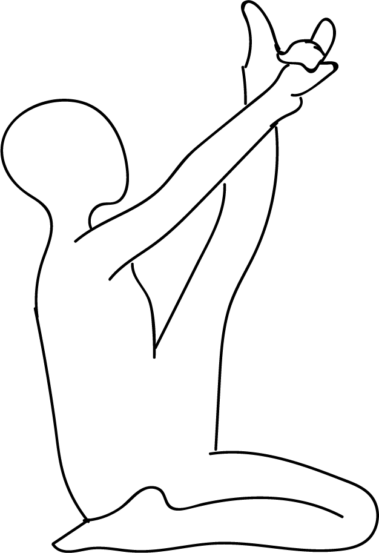

# Krauncasana

[TOC]

**Kraunchasana** is an Asana. It is translated as **Heron Pose** from Sanskrit. the name of this pose comes from "krauncha" meaning "heron", and "asana" meaning "posture" or "seat".

## Technique
1. Begin seated in Staff Pose (Dandasana), with both legs extended straight out in front of you, spine long.
1. Bend your right knee into Hero pose (Virasana), so that the right shin is resting on the floor and the heel of the right foot is beside the right hip. Ensure that the toes of your right foot are pointing straight back and that your thighs are parallel to one another (i.e. the right knee isn’t bowing out to the side).
1. Bend your left knee so that the sole of your left foot rests on the floor just in front of the left sit bone.
1. Take a hold of the outer edges of your left foot with both hands, and begin to extend the leg as straight as possible. Lean back slightly, keeping your gaze on your left foot, and keep the core strong and engaged.
1. On an inhale, raise the leg as high as you comfortably can. Focus on keeping your spine long and your chest lifted, rather than rounding the spine and collapsing through the chest in an effort to bring the lifted shin closer toward your face. With every breath, grow taller along the spine and lift the ribcage higher.
1. Remain in the pose for 3 to 5 full breaths. On an exhale, gently bend and lower the left leg and return to Dandasana. When you feel ready, repeat on the other side.

## Technique in pictures/animation
## Effects
* Stretches the hamstrings
* Stimulates the abdominal organs and heart

## Related Asanas
* [Adho Mukha Svanasana](../yoga/Adho_Mukha_Svanasana.md)
* [Baddha Konasana](Baddha_Konasana.md)

## Special requisites
* Menstruation
* If you have any serious knee or ankle problems, avoid the Ardha Virasana (Half Hero Pose) leg position in this pose unless you have the assistance of an experienced instructor

## Initial practice notes
Beginning students might have some difficulty doing this pose with the down leg in Ardha Virasana.

## References

## External Links
* [Krauncasana on wisdomlib.org](https://www.wisdomlib.org/definition/krauncasana)
* [Krauncasana on stylesatlife.com](http://stylesatlife.com/articles/krauncasana/)

## References

1. ["Methodology"](https://www.doyouyoga.com/how-to-do-heron-pose/)
2. [tips"]("Beginers)(https://www.yogajournal.com/poses/heron-pose)
3. [benefits"]("Health)(http://stylesatlife.com/articles/krauncasana/)
