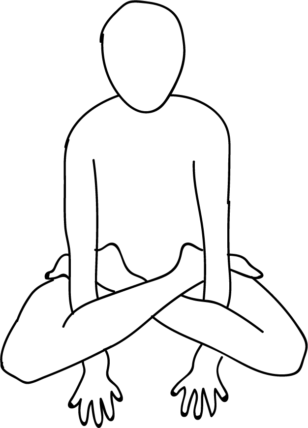

# Kukkutasana

[TOC]

**Kukkutasana** is an asana. In Sanskrit **kukkuta** means a **cockerel** or a **rooster** and **asana** means a **pose**. In the final position, it resembles a rooster.

## Technique
1. First sit in the Lotus Pose (Padmasana).Kukkutasana-steps
1. Put your arms in-between the gape of your thighs and calf muscles, and your palms should touch the ground or floor through this gape.
1. Now spread out your fingers, pointing forward.
1. push your palms as much as possible. After that, breathe in while you try to lift your body.
1. You have to support your body weight by your palms. By daily practice, you will gain the ability to achieve balance.
1. Hold the Position for 1 to 5 minutes and breathes normally.
1. Breathe out and release the pose and get back to the ground.
1. As per your convenience repeat the pose as much as you can.

## Technique in pictures/animation
## Effects
* This asana makes the muscles in the arms and the shoulders strong.
* It also helps to make the chest broader.
* The legs are loosened up.
* This asana builds balance and stability and also helps you focus.
* The perineum contracts during this asana, therefore, the muscles are strengthened.
* This asana activates and regulates the Muladhara Chakra.
* It stimulates the digestive system.
* It helps relieve menstrual discomfort and hip pain.

## Related Asanas
* [Adho Mukha Svanasana](../yoga/Adho_Mukha_Svanasana.md)

## Special requisites
It is essential to practice this pose correctly to avoid injury.

* Keep the spine erect as hunching will lead to misalignment of the body in the pose.
* Avoid practicing Cockerel Pose in case you suffer from any of these: high blood pressure, heart or lung problems, back pain, hernia, prolapse, gastric ulcers, enlarged spleen or knee injuries.

## Initial practice notes
* As a Learner or Beginner, it may be difficult to get this asana right. These pointers will help you keep up the stance easily.
* Turn your look to a specific point of convergence at a separation and focus on it. This ought to help you look after equalization.
* This is one of the Asanas prescribed in [Hatha Yoga Pradipika](Hatha_Yoga_Pradipika_(book).md).

## References

## External Links
* [Kukkutasana on yogicwayoflife.com](http://www.yogicwayoflife.com/kukkutasana-the-cockerel-pose/)
* [Kukkutasana on lifetimestyles.com](http://www.lifetimestyles.com/yoga-poses/health-benefits-of-kukkutasana)
* [Kukkutasana on epainassist.com](https://www.epainassist.com/yoga/kukkutasana-or-rooster-pose)

## References

1. ["Methodology"](https://www.sarvyoga.com/kukkutasana-cock-or-rooster-pose-steps-and-benefits/)
2. [tips"]("Beginers)(http://www.stylecraze.com/articles/what-is-kukkutasana-yoga-and-benefits/#TheBenefitsOfTheCockPose)
3. [benefits"]("Health)(http://www.finessyoga.com/yoga-asanas/kukkutasana-cockerel-pose-steps-benefits)
