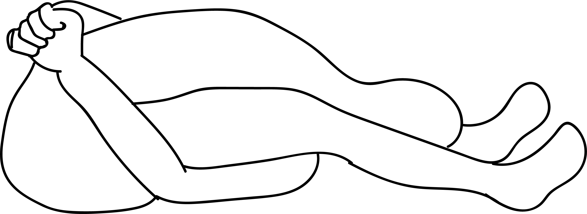

# Kurmasana

[TOC]

**Kurmasana** or the Tortoise Pose is so called because the asana looks like a tortoise in the final pose. In Sanskrit, Kurma means tortoise. When we observe a tortoise, we see that only the hands and legs protrude out from the shell. In the final position, this asana imitates the tortoise.

## Technique
1. Sit on the floor with the legs spread out in front of you.
1. Bend forward with the forehead almost touching the floor in front of you.
1. Pass the hands under the knees.
1. Bend forward to touch the forehead to the ground and slide the hands further under the knees towards the back. Exhale as you bend forward.
1. Clasp the two hands behind the back. This is the final position.
1. Practice normal breathing in the final position. Relax your abdomen and back muscles in the final pose.
1. Maintain the position for as long a comfortable. During the final stage, awareness must be on relaxing the back and spinal muscles and on the slow rhythmic breathing. For spiritual benefits, one may also concentrate on the Swadhistana or Manipuraka Chakra.

## Technique in pictures/animation
## Effects
* It stretches your legs, back, shoulders and chest also.
* It improves the functions of the respiratory and digestive systems.
* It lengthens the back muscles.
* The organs in the midriff (abdomen) are stimulated during this Asana.
* The stance helps you to spread out both your shoulders and your hips.
* The spine is stretched longer during the act of this yoga asana.
Anxiety buster.
* Beneficial in Asthma, constipation and flatulence.
* Useful in sleeping disorder like Insomnia.
* Beneficial in the problems related to the back or spine.

## Related Asanas
* [Uttanasana](../yoga/Uttanasana.md)
* [Paschimottanasana](../yoga/Paschimottanasana.md)
* [Dhanurasana](../yoga/Dhanurasana.md)

## Special requisites
It is essential to practice this pose correctly to avoid injury.

* Those suffering from sciatica and slipped disk should avoid this asana.
* Those having hernia and chronic arthritis should not do Kurmasana.

## Initial practice notes
Kurmasana is an advanced pose, and it takes a certain amount of time to get into it appropriately.

This is one of the Asanas prescribed in [Hatha Yoga Pradipika](Hatha_Yoga_Pradipika_(book).md).

## References

## External Links
* [Kurmasana on yogajournal.com](https://www.yogajournal.com/poses/4-steps-master-tortoise-pose-kurmasana)
* [Kurmasana on yogawiz.com](http://www.yogawiz.com/yoga-poses/seated-poses/tortoise-pose.html)
* [Kurmasana on easyayurveda.com](https://easyayurveda.com/2018/04/11/kurmasana-tortoise-pose-turtle/)

## References

1. ["Methodology"](http://www.yogicwayoflife.com/kurmasana-the-tortoise-pose/)
2. [tips"]("Beginers)(http://www.stylecraze.com/articles/kurmasana-tortoise-pose-steps-and-benefits/#gref)
3. [benefits"]("Health)(https://www.sarvyoga.com/kurmasana-tortoise-pose-steps-and-benefits/)
