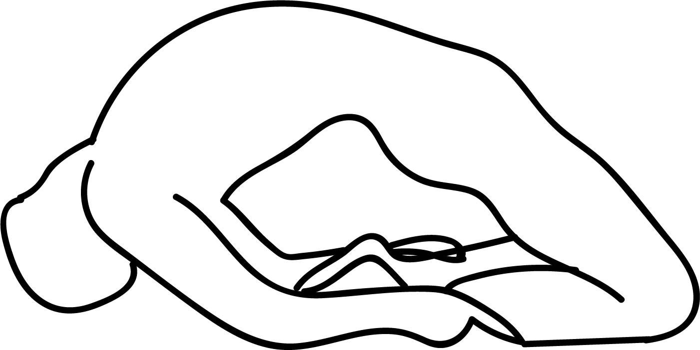

# Laghu vajrasana

[TOC]

**Laghuvajrasana** is an Asana. It is translated as **Little Thunderbolt Pose** from Sanskrit.
The name of this pose comes from **laghu** meaning **small**, **vajra** meaning **thunderbolt**, and **asana** meaning **posture** or **seat**.

## Technique
1. From the seated pose in Vajrasana, inhale take the elbows and place them on the floor besides you and gently go backwards with the torso with the arm support.
1. Inhale again and taking the neck and shoulders backwards, place the crown of the head on the floor while raising the chest, abdomen, hips and thighs outwards and upwards.
1. Going into Laghu Vajrasana, may require a great deal of understanding of the body and hence go slow with breathing. Here while the crown of the head is on the floor, you could place the arms stretched out while holding the upper part of the calves with your hands.
1. Be here in Little Thunderbolt Pose for about 6 breaths if possible or more, and watch for this deep back bend stretch.

## Technique in pictures/animation
## Effects
* Improved digestion
* Super flexible spine
* Improves flexibility of knees and ankles to prevent arthritis and gout attacks
* Provides strength to the whole abdomen area, particularly the intestines
* It is a wonderful exercise for the chest. It strengthen and widen the chest muscles
* Tone up the thighs, belly and limbs
* Gives strength to the back. If you are dealing with sciatica or back problem, practice laghu vajrasana regularly.

## Related Asanas
* [vajrasana](vajrasana.md)

## Special requisites
Avoid Laghu vajrasana if you are dealing with any of the below health conditions:

* Severe joint pain, arthritis or gout
* Injury or surgery related to knees, legs, back or neck
* High blood pressure
* Chronic back pain or slip disc

## Initial practice notes
## References

## External Links
* [Laghuvajrasana on yogadragonden.blogspot.com](http://yogadragonden.blogspot.com/2012/05/laghu-vajrasana-strength-commitment-and.html)
* [Laghuvajrasana on tummee.com](https://www.tummee.com/yoga-poses/laghu-vajrasana)

## References

1. ["Methodology"](https://www.tummee.com/yoga-poses/laghu-vajrasana)
2. [benefits"]("Health)(http://www.cnyhealingarts.com/2011/01/07/the-health-benefits-of-ananda-balasana-happy-baby-pose/)
