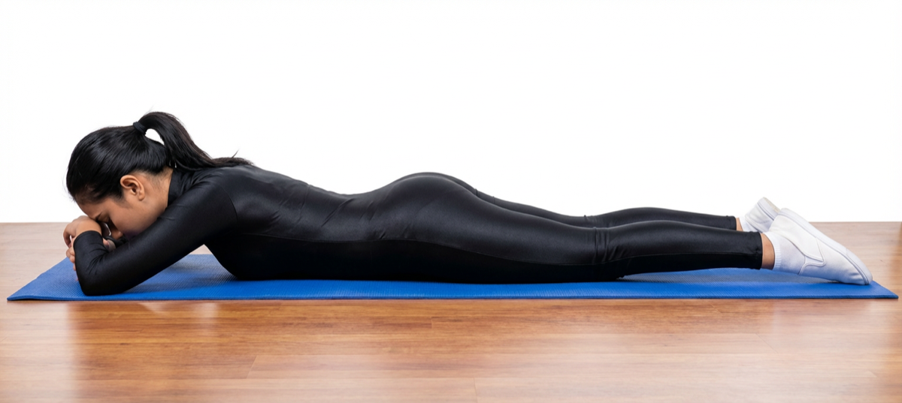

# Makarasana

[TOC]

**Makarasana** or the Crocodile pose is a yoga asana used for relaxation. In sanskrit, **Makar** means crocodile and **Asana** means a pose. Makarasana is a yogic pose useful for people with back and shoulder problems.

## Technique
1. Lie on your belly, with the arms crossed under your head. Rest the forehead on the wrists of the hands.
1. Close the eyes and let your whole body relax into the floor.  Let the heels turn out and let the legs flop open.
1. Breathe deeply, pressing the belly down into the floor with each inhalation and hold for 6-10 breaths. With each exhalation allow your body to relax deeper into the floor.
1. To release: bring the palms under your shoulders and slowly press up into table or child pose or roll over onto your back.

## Technique in pictures/animation
## Effects
* Beneficial in cervical, slip disc, spondylitis, sciatica.
* Beneficial in all spine related problems.
* Very useful in Asthama, knee pain, and other lungs related problems.
* Stretches the muscles of legs and hips.
* This pose is best for relaxing after doing other Asana.

## Related Asanas
* [Bhujangasana](../yoga/Bhujangasana.md)
* [Gomukhasana](../yoga/Gomukhasana.md)
* [Sethu Bandhasana](Sethu_Bandhasana.md)

## Special requisites
It is essential to practice this pose correctly to avoid injury.

* Avoid moving the body in this asana as it may disturb the practice.
* Don’t put stress on the body during this asana as it is all about peacefully relaxing the body.
* Avoid practicing this asana in the disturbing atmosphere as it may disturb the peace of mind.
* Those who have exaggerated lumbar curve should not practice Makarasana.

## Initial practice notes
Initially, it might be tough to balance yourself in the pose. You might shuffle a bit due to imbalance. To avoid this, use your hands for support and raise them to complete the asana. With practice, your balance will improve, and you can assume the pose in the correct manner.

## References

## External Links
* [Makarasana on finessyoga.com](http://www.finessyoga.com/yoga-asanas/basic-asanas/makarasana-steps-precautions-benefits)
* [Makarasana on yogicwayoflife.com](http://www.yogicwayoflife.com/makarasana-the-crocodile-pose/)
* [Makarasana on eyogaguru.com](https://eyogaguru.com/makarasana-crocodile-pose-steps-and-benefits-eyogaguru/)

## References

1. ["Methodology"](http://www.yogabasics.com/asana/crocodile/)
2. [tips"]("Beginers)(http://www.stylecraze.com/articles/makarasana-crocodile-pose-steps-and-benefits/#gref)
3. [benefits"]("Health)(https://www.sarvyoga.com/makarasana-crocodile-pose-steps-and-benefits/)
