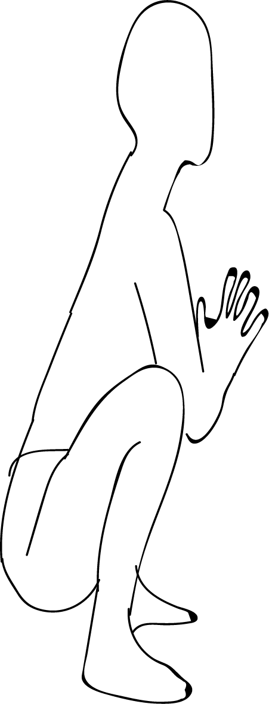

# Malasana

[TOC]

**Mālāsana** is a term for various squatted āsanas. The term is being used in various western transliterations, and may refer to various asanas, all involving a squatted position.

## Technique
1. Start by doing squatting. During this, put your feet near to each other, with your heels on the ground or supported on the floor.
1. Now stretch out your thighs, putting them smoothly wider than your torso.
1. Breathe out and bend forward in a way that your torso fits comfortably in between your thighs.
1. Now make Anjali Mudra (Namaste posture) by your palms, by your elbows make some pressure against the inner thighs. By this the front part of your torso is stretched.
1. Then press your inner thighs against the side of the middle (torso). At that point, extend your arms, and swing them crosswise over with the end goal that your shins fit into the armpits. Hold your lower legs (Ankles).
1. Remain in the pose for 60 seconds. Breathe in and release the pose..

## Technique in pictures/animation
## Effects
* Opens your hips and groin
* Stretches your ankles, lower hamstrings, back and neck
* Tones your abdominals
* Aids in digestion
* Strengthens your metabolism
* Keeps your pelvic and hip joints healthy
* Ideal for prenatal yoga

## Related Asanas
* [Baddha Konasana](Baddha_Konasana.md)
* [Upavistha Konasana](../yoga/Upavistha_Konasana.md)
* [Virasana](../yoga/Virasana.md)

## Special requisites
It is essential to practice this pose correctly to avoid injury:

* ankle injury
* knee injury

## Initial practice notes
If you find it difficult to squat initially, sit on the edge of a chair, and let your thighs and torso form a 90-degree angle. Place your heels on the floor such that they are a little ahead of your knees.

## References

## External Links
* [Malasana on doyouyoga.com](https://www.doyouyoga.com/3-reasons-to-practice-malasana-or-yoga-squats-97924/)
* [Malasana on yogajournal.com](https://www.yogajournal.com/practice/learn-malasana)
* [Malasana on easyayurveda.com/](https://easyayurveda.com/2018/04/16/malasana-garland-pose-necklace-squat-pose/)

## References

1. ["Methodology"](https://www.sarvyoga.com/malasana-garland-yoga-pose-steps-and-benefits/)
2. [tips"]("Beginers)(http://www.stylecraze.com/articles/malasana-yoga-squat-garland-pose/#gref)
3. [benefits"]("Health)(http://www.cnyhealingarts.com/2011/05/04/the-health-benefits-of-malasana-garland-pose/)
