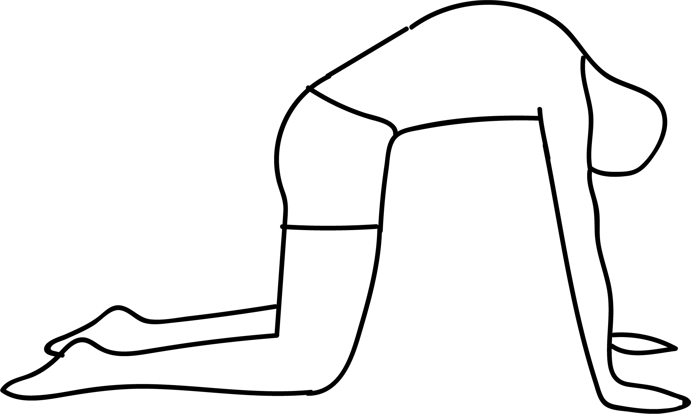

# Marjaryasana

[TOC]

**Marjaryasana** is an Asana. It is translated as Cat Pose from Sanskrit. The name of this pose comes from **marjara** meaning **cat**, and **asana** meaning **posture** or **seat**.

## Technique
1. Get down onto your hands and knees, placing each hand directly under its shoulder and each knee under its hip. Point your fingers up to the top of your mat.
1. Relax your head and neck into a neutral position, looking downward.
1. Move first into Cow Pose by breathing in and relaxing your belly toward the floor.
1. Visualize your breath moving into your lungs and along your back while you lift your chin and chest and look up to the ceiling. Hold for a few seconds.
1. Now gently move into Cat Pose by exhaling while you pull your belly in toward your spine.
1. Round your back and allow your head and neck to relax back downward.
1. Visualize your breath travelling out of your body along your spine and out your mouth and nose.
1. Inhale again, transitioning into Cow pose.
1. Exhale again, transitioning into Cat pose.

## Technique in pictures/animation
## Effects
* Helps provide sturdiness and overall durability to your spinal column thus improving your posture.
* Stretches our your back and torso while relieving tension in your lower back.
* Helps to regulate blood circulation throughout your body.
* Helps to relieve stress

## Related Asanas
* [Bālāsana](Bālāsana.md)
* [Garudasana](../yoga/Garudasana.md)

## Special requisites
It is essential to practice this pose correctly to avoid injury.

* Neck injury

## Initial practice notes
The cat pose yoga is fairly a simple pose. But in the event you find it hard to round the top of your upper back, you could ask a friend or your instructor to help you out.

## References

## External Links
* [Marjaryasana on vinyasayogaacademy.com](http://vinyasayogaacademy.com/blog/benefit-of-marjaryasana-bitilasana-cat-cow/)
* [Marjaryasana on yogajournal.com](https://www.yogajournal.com/poses/cat-pose)
* [Marjaryasana on easyayurveda.com](https://easyayurveda.com/2018/04/17/marjaryasana-bitilasana-cat-cow-pose/)

## References

1. ["Methodology"](https://arogyayogaschool.com/blog/health-benefits-cat-cow-poses-marjaryasana-bitilasana/)
2. [tips"]("Beginers)(http://www.stylecraze.com/articles/majariasana-cat-pose/#BeginnersTips)
3. [benefits"]("Health)(https://thehealthorange.com/stay-fit/yoga/how-to-do-marjaryasana-cat-pose-in-5-steps-its-benefits/)
