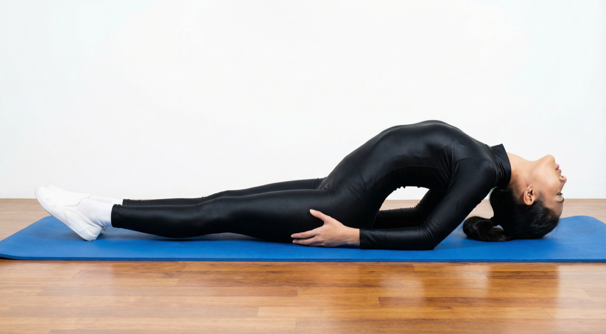

# Matsyasana

[TOC]

**Matsyasana** or Fish Pose is an asana. It is commonly considered a counterasana to Sarvangasana, or shoulder stand, specifically within the context of the Ashtanga Vinyasa Yoga Primary Series.

## Technique
1. Begin with the Shavasana (Corpse Pose)
1. Maintain a flat back. Make sure your arms are straight, with palms laid out on the mat.
1. Gently, bring your palms in under your buttocks.
1. Tip your head backwards slightly with your torso resting on the floor. Hold for a minimum of 30 seconds.
1. Inhale and use your forearms to lift your chest, shoulders, upper back, and head off the mat.
1. Bring the top of your head to rest on the mat and hold this position for a minimum of 30 seconds.
1. Return to the initial position.
1. Relax and inhale.
1. Repeat the process 6-8 times.

## Technique in pictures/animation
## Effects
* Stretches your deep hip flexors and intercostals (muscles between the ribs)
* Relieves tension in your neck, throat, and shoulders
* Stretches and tones the front of your neck and your abdominals
* Stretches and stimulates the organs of your belly and throat
* Strengthens your upper back and the back of your neck
* Relieves stress and irritation
* Improves posture
* Therapeutic for rounded-shoulders, asthma, spasms in the bronchial tubes, and other respiratory issues

## Related Asanas
* [Baddha Konasana](Baddha_Konasana.md)
* [Bhujangasana](../yoga/Bhujangasana.md)
* [Dhanurasana](../yoga/Dhanurasana.md)
* [Salabhasana](../yoga/Salabhasana.md)

## Special requisites
It is essential to practice this pose correctly to avoid injury.

* High or low blood pressure
* Migraine
* Insomnia
* Serious lower-back or neck injury

## Initial practice notes
Beginners sometimes strain their neck in this pose. If you feel any discomfort in your neck or throat, either lower your chest slightly toward the floor, or put a thickly folded blanket under the back of your head.

## References

## External Links
* [Matsyasana on stylecraze.com](http://www.stylecraze.com/articles/matsyasana-fish-pose/#TheBenefitsOfTheFishPose)
* [Matsyasana on rishikulyogshala.org](https://www.rishikulyogshala.org/the-health-benefits-of-matsyasana-fish-pose/)
* [Matsyasana on thehealthorange.com](https://thehealthorange.com/stay-fit/yoga/how-to-do-matsyasana-fish-pose-in-12-steps-its-benefits/)

## References

1. ["Methodology"](https://arogyayogaschool.com/blog/health-benefits-matsyasana-fish-pose/)
2. [tips"]("Beginers)(https://www.yogajournal.com/poses/fish-pose)
3. [benefits"]("Health)(http://www.cnyhealingarts.com/2011/08/05/the-health-benefits-of-matsyasana-fish-pose/)
