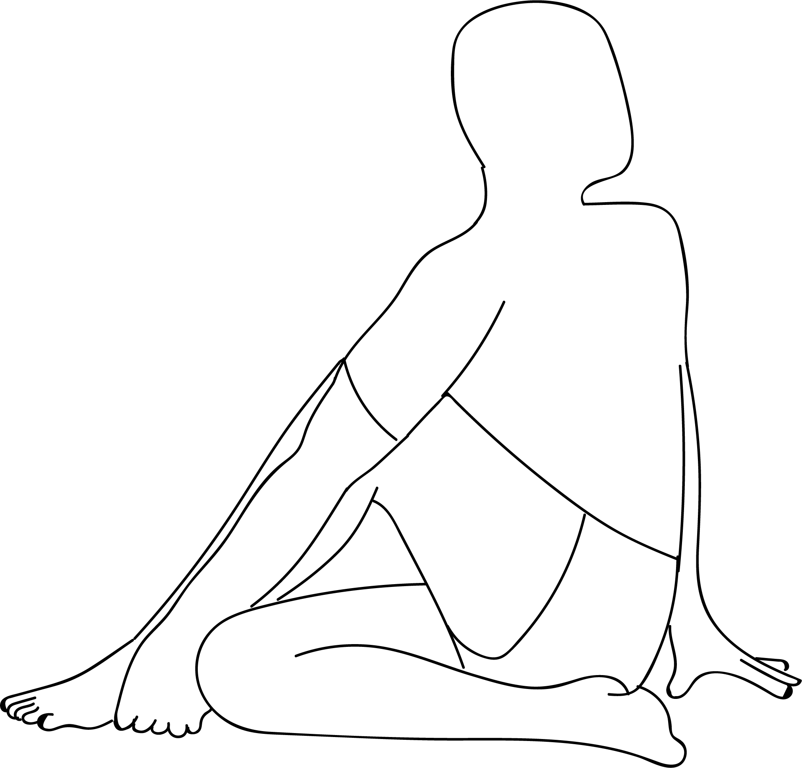

# Matsyendrasana

[TOC]

**Matsyendrasana** is an asana. It is translated as **Lord of the Fishes Pose** from Sanskrit.

## Technique
1. Lie flat on your back. Inhale and lift your legs up, bringing both your knees close to your chest.
1. Hold your big toes. Make sure your arms are pulled through the insides of your knees as you hold your toes. Gently open up your hips and widen your legs to deepen the stretch.
1. Tuck your chin into your chest and make sure your head is on the floor.
1. Press the tailbone and the sacrum down to the floor while you press your heels up, pulling back with your arms.
1. Press both the back of the neck and the shoulders down to the floor. The whole area of the back and the spine should be pressed flat on the floor.
1. Breathe normally and hold the pose for about 30 seconds to a minute.
1. Exhale and release your arms and legs. Lie on the floor for a few seconds before you move on to the next asana.

## Technique in pictures/animation
## Effects
* Releases lower back and sacrum
* Opens hips, inner thighs, and groin
* Stretches the hamstrings
* Relieves lower back pain
* Stretches and soothes the spine
* Calms the brain
* Helps relieve stress and fatigue

## Related Asanas
* [Adho Mukha Svanasana](../yoga/Adho_Mukha_Svanasana.md)

## Special requisites
It is essential to practice this pose correctly to avoid injury.

* If you are suffering from a neck injury, it might be a good idea to use a thickly folded blanket to support the head.

* You must ensure your spine is absolutely straight while practicing this asana to avoid any kind of injury.

* Pregnant women and women who are menstruating must avoid practicing this asana.

* People suffering from high blood pressure and knee injuries should also avoid this asana.

## Initial practice notes
* If you find it difficult to hold your feet, use a yoga strap by looping it around the middle arch.
* When you do this asana, you might let your tailbone arch towards the ceiling. But you have to make sure your tailbone is pressed to the floor. Only then, the hips flexibility will increase.

* This is one of the Asanas prescribed in [Hatha Yoga Pradipika](Hatha_Yoga_Pradipika_(book).md).

## References

## External Links
* [Ananda Balasana on epainassist.com](https://www.epainassist.com/yoga/ananda-balasana-or-happy-baby-pose)
* [Ananda Balasana on rishikulyogshala.org](https://www.rishikulyogshala.org/top-10-health-benefits-of-ananda-balasana-happy-baby-pose/)
* [Ananda Balasana on yogicwayoflife.com](http://www.yogicwayoflife.com/ananda-balasana-happy-baby-pose/)

## References

1. ["Methodology"](http://www.stylecraze.com/articles/ananda-balasana-benefits/#HowToDoThisAsana)
2. [tips"]("Beginers)(http://www.stylecraze.com/articles/ananda-balasana-benefits/#BeginnersTips)
3. [benefits"]("Health)(http://www.cnyhealingarts.com/2011/01/07/the-health-benefits-of-ananda-balasana-happy-baby-pose/)
