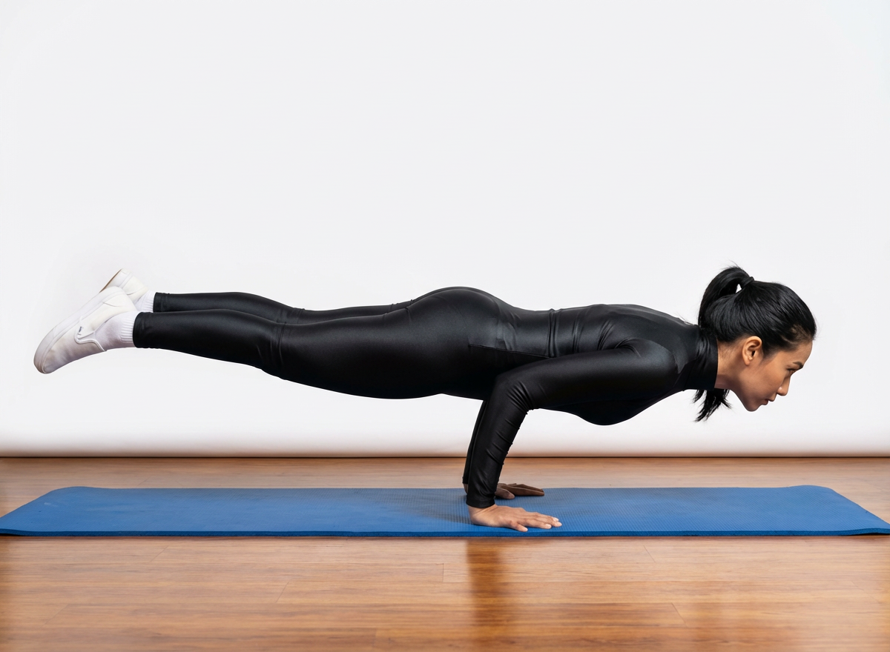

# Mayurasana

[TOC]

**Mayurasana** (Sanskrit: मयूरासन) or Peacock Pose is an asana where the individual assumes a peacock like posture. This asana tones up the abdominal portion of the body. It also strengthens the fore arms, wrists and elbows.

## Technique
1. Kneel on the floor, knees wide, and sit on your heels.
1. Lean forward and press your palms on the floor with your fingers turned backwards. The palms should be placed between the two thighs. The elbows should rest on the abdomen.
1. Slowly move the legs back, one after the other so that they are straight and the toes touch the floor.
1. Raise the whole body by tensing the abdominal muscles and resting the weight entirely on the palms. Try to make the body horizontal and parallel to the ground. The body is balanced by the elbows on the abdominal muscles. The weight is entirely borne by the forearm and palms.
1. Try to maintain this pose for 5 seconds in the beginning. Slowly, it can be increased to 1 minute or more.

## Technique in pictures/animation
## Effects
* Peacock Pose removes toxins and detoxifies your body.
* Improves the function of digestive system and makes abdomen stronger.
* Peacock Pose is beneficial in piles and diabetes.
* Strengthens and tones your reproductive system.
* Mayurasana Improves sexual activity.
* Makes your elbows, wrist, spine, and shoulders stronger.
* Mayurasana improves your posture.
* Reduces anxiety and stress and give calmness to the mind.
* Increases your focusing power of the mind.

## Related Asanas
* [Chaturanga Dandasana](../yoga/Chaturanga_Dandasana.md)
* [Eka Pada Sirsasana](../yoga/Eka_Pada_Sirsasana.md)

## Special requisites
Avoid this asana in case you have the following conditions:

* Heart diseases
* Hernia
* High blood pressure
* Eye, ear, and nose infections
* Problems in the intestine

## Initial practice notes
As a beginner, you might find it hard to balance yourself in this asana. To get the asana right, use blocks to support your head and ankles till you get a hang of the asana.

This is one of the Asanas prescribed in [Hatha Yoga Pradipika](Hatha_Yoga_Pradipika_(book).md).

## References

## External Links
* [Mayurasana on yogajournal.com](https://www.yogajournal.com/practice/go-with-your-gut)
* [Mayurasana on doyouyoga.com](https://www.doyouyoga.com/how-to-do-mayurasana-or-peacock-pose-93388/)
* [Mayurasana on wikihow.com](https://www.wikihow.com/Do-the-Peacock-Posture)

## References

1. ["Methodology"](http://www.yogicwayoflife.com/mayurasana-the-peacock-pose/)
2. [tips"]("Beginers)(http://www.stylecraze.com/articles/mayurasana-peacock-pose/#Beginner’sTip)
3. [benefits"]("Health)(https://www.sarvyoga.com/mayurasana-peacock-pose-steps-and-benefits/)
