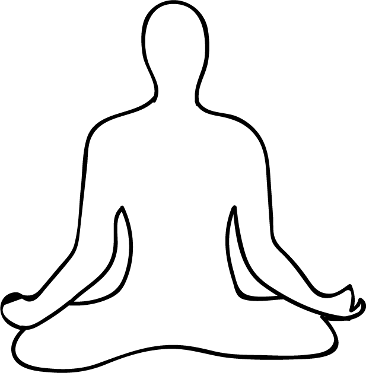

# Meditation

**Meditation** is a practice where an individual trains the mind or induces a mode of consciousness, either to realize some benefit or for the mind to simply acknowledge its content without becoming identified with that content,
1. or as an end in itself.
1. The term meditation refers to a broad variety of practices that includes techniques designed to promote relaxation, build internal energy or life force (qi, ki, prana, etc.) and develop compassion,
1. love, patience, generosity, and forgiveness. A particularly ambitious form of meditation aims at effortlessly sustained single-pointed concentration
1. Meant to enable its practitioner to enjoy an indestructible sense of well-being while engaging in any life activity.The word meditation carries different meanings in different contexts. Meditation has been practiced since antiquity as a component of numerous religious traditions and beliefs.
1. Meditation often involves an internal effort to self-regulate the mind in some way. Meditation is often used to clear the mind and ease many health concerns, such as high blood pressure,depression, and anxiety. It may be done sitting, or in an active way—for instance, Buddhist monks involve awareness in their day-to-day activities as a form of mind-training. Prayer beads or other ritual objects are commonly used during meditation in order to keep track of or remind the practitioner about some aspect of that training.Meditation may involve generating an emotional state for the purpose of analyzing that state—such as anger, hatred, etc.—or cultivating a particular mental response to various phenomena, such as compassion.
1. The term "meditation" can refer to the state itself, as well as to practices or techniques employed to cultivate the state.
1. Meditation may also involve repeating a mantra and closing the eyes.
1. The mantra is chosen based on its suitability to the individual meditator. Meditation has a calming effect and directs awareness inward until pure awareness is achieved, described as "being awake inside without being aware of anything except awareness itself.
1. "In brief, there are dozens of specific styles of meditation practice, and many different types of activity commonly referred to as meditative practices.

## References
1. The above mentioned information is added from the book called **"MUDRAS & HEALTH PERSPECTIVES"** by *"SUMAN.K.CHIPLUNKAR"*.
