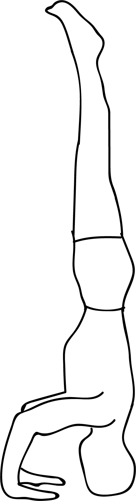

# Mukta Hasta Sirsasana

[TOC]

**Mukta Hasta Sirsasana**  is an Asana. It is translated as Hands Free Headstand Pose from Sanskrit. It is a variation of Sirsasana (Headstand).
The name of this pose comes from "mukta" meaning "free", "hasta" meaning "hand", "sirsa" meaning "head", and "asana" meaning "posture" or "seat". There are three variations of the pose, A, B, and C. You can find these in the **Ashtanga** system of yoga.

## Benefits
1. As with all inversions.
1. There the heart if above the head
1. This pose brings fresh blood flow to the internal organs of the torso
1. It also creates a sense of balance
1. Helps strengthen the neck and back.

## Cautions
* Be careful while doing this pose if you have high blood pressure or any neck injuries.

## References

## References

1. ["wikipedia"](https://en.wikipedia.org/wiki/Muktahasta%C5%9B%C4%ABr%E1%B9%A3%C4%81sana)
