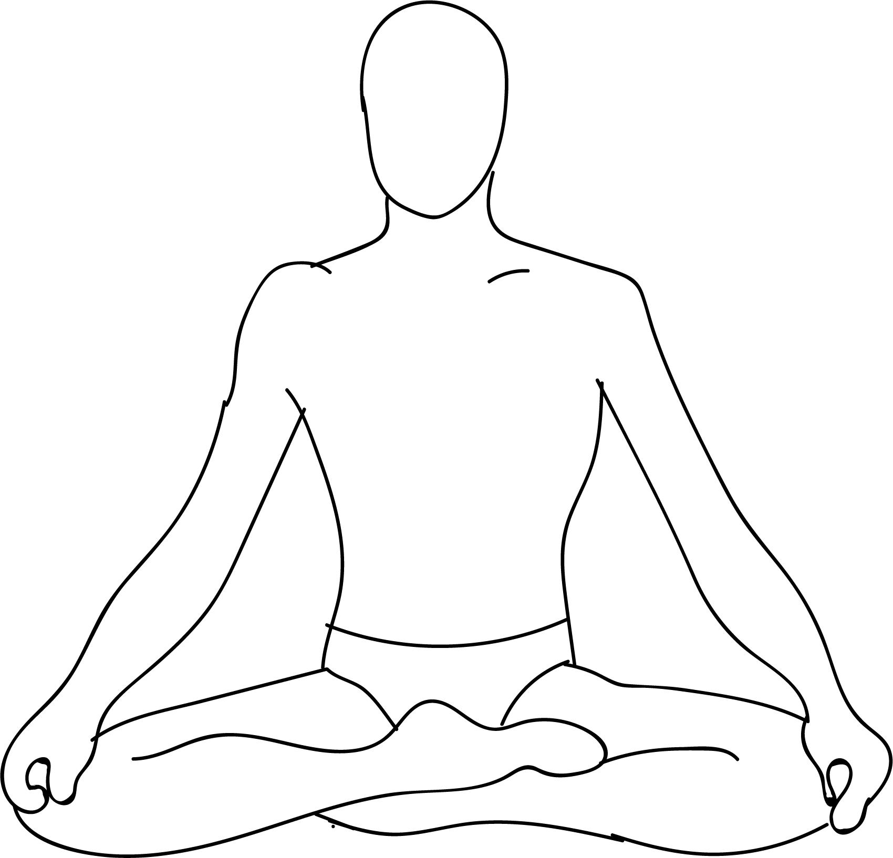

# Muktasana

[TOC]

**Muktasana** also known as Pavana Muktasana is an Asana. It is translated as Wind Relieving Pose from Sanskrit. The name of this pose comes from **mukta** meaning **free**, and **asana** meaning **posture** or **seat**.

## Technique
* Lie flat on your back on a smooth surface, ensuring that your feet are together, and your arms are placed beside your body.
* Take a deep breath. As you exhale, bring your knees towards your chest, and press your thighs on your abdomen. Clasp your hands around your legs as if you are hugging your knees.
* Hold the asana while you breathe normally. Every time you exhale, make sure you tighten the grip of the hands on the knee, and increase the pressure on your chest. Every time you inhale, ensure that you loosen the grip.
* Exhale and release the pose after you rock and roll from side to side about three to five times. Relax.

## Technique in pictures/animation
## Effects
* This asana cures acidity problems, indigestion and constipation.
* Pavanamuktasana is very good for the abdominal organs
* Regular practice of this asana cures gastric problems
* This asana is very helpful for people suffering from arthritis pain, heart problems, waist pain and acidity.
* This asana gives flat stomach.  So every one can practice this asana for flat stomach
* This asana strengthens the digestive system, purifies impure air, helps in diabetes, high blood pressure.

## Related Asanas
* [Sulabh Pawanmuktasana](Sulabh_Pawanmuktasana.md)
* [Ardha Pawanmuktasana](Ardha_Pawanmuktasana.md)

## Special requisites
These are a few points of caution to keep in mind before you do the Pawanmuktasana.

* This asana must be avoided if you have had an abdominal surgery recently. Also, people suffering from hernia or piles must avoid this asana.
* This asana must not be practiced by pregnant women. Menstruating women can avoid this asana if they are not comfortable.
* If you are suffering from heart problems, hyperacidity, high blood pressure, slip disc, hernia, back and neck problems, or a testicle disorder, you must avoid this asana.
* If you have had a neck injury, but have a doctor’s approval to practice this asana, your head must remain on the floor as you practice it.

## Initial practice notes
Although you must keep your buttocks lifted off the floor, try to keep your lower back grounded on the floor as you practice this asana.

## References

## External Links
* [Muktasana on yogaindailylife.org](https://www.yogaindailylife.org/system/en/level-1/sarva-hita-asanas-part-1/pavana-muktasana)
* [Muktasana on yogapedia.com](https://www.yogapedia.com/definition/7190/muktasana)
* [Muktasana on bhaskar.com](https://daily.bhaskar.com/news/HEA----pawan-muktasana----a-very-powerful-yoga-with-multiple-benefits-for-the-body-4174922-NOR.html)

## References

1. ["Methodology"](http://www.stylecraze.com/articles/pawanmuktasana-yoga-what-is-it-and-benefits/#gref)
2. [tips"]("Beginers)(http://www.stylecraze.com/articles/pawanmuktasana-yoga-what-is-it-and-benefits/#gref)
3. [benefits"]("Health)(http://yogaforyourhealthbenefits.blogspot.com/2013/08/pavana-muktasana-practice-and-benefits.html)
