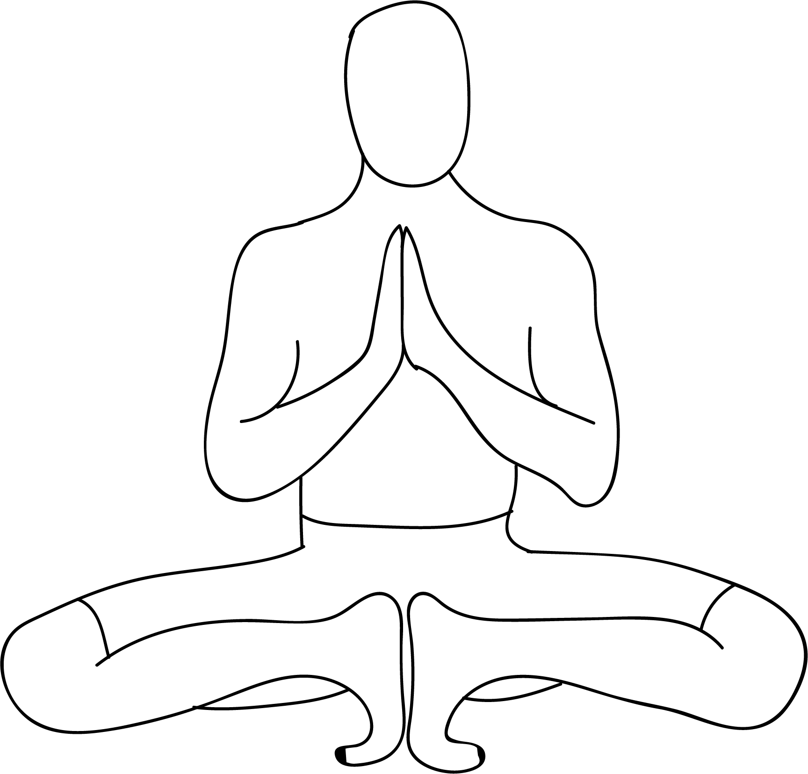

# Mulabandhasana

[TOC]

**Mulabhandasana** is an Asana. It is translated as Root Lock Pose from Sanskrit.
The name of this pose comes from "mula bhanda" meaning "root lock", and "asana" meaning "posture" or "seat".

## Technique
1. Lie flat on your back. Inhale and lift your legs up, bringing both your knees close to your chest.
1. Hold your big toes. Make sure your arms are pulled through the insides of your knees as you hold your toes. Gently open up your hips and widen your legs to deepen the stretch.
1. Tuck your chin into your chest and make sure your head is on the floor.
1. Press the tailbone and the sacrum down to the floor while you press your heels up, pulling back with your arms.
1. Press both the back of the neck and the shoulders down to the floor. The whole area of the back and the spine should be pressed flat on the floor.
1. Breathe normally and hold the pose for about 30 seconds to a minute.
1. Exhale and release your arms and legs. Lie on the floor for a few seconds before you move on to the next asana.

## Effects
* Begin in Dandasana / Staff Pose.

* Bend you knees and join your feet together.

* Inhale and lift your heels up. Balance your body on your toes.

* Sit on your ankles and drop your knees to the side.

* Straighten your back and join your palms in Pranam Mudra.

* Inhale and contract the perineal muscles.

* Stay in this pose for as long as you can.

Rest in Dandasana / Staff Pose.

## Related Asanas
* [Adho Mukha Svanasana](../yoga/Adho_Mukha_Svanasana.md)
* [Baddha Konasana](Baddha_Konasana.md)
* [Dandasana](../yoga/Dandasana.md)

## Special requisites
* Anyone suffering from severe leg or hip injuries, hernia, diarrhea or other stomach ailments.

## Initial practice notes
It is to be remembered that this pose is the tightening of pelvic floor muscles instead of whole perineum. Hence, men are required to contract their muscles between the testes as well as anus while women are required to contract their muscles behind the cervix. Ashwini mudra as well as Vajroli mudra can be prepared initially in order to complete the Mulabandhasana properly.

## References

## External Links
* [Mulabandhasana on yogayukta.com](https://yogayukta.com/876/mula-bandha-the-root-lock-practice-benefits-and-contraindications/)
* [Mulabandhasana on yogajournal.com](https://www.yogajournal.com/poses/upward-abdominal-lock)
* [Mulabandhasana on yogainternational.com](https://yogainternational.com/article/view/a-beginners-guide-to-mula-bandha-root-lock/)

## References

1. ["Methodology"](https://365dayspact.wordpress.com/2017/08/16/mulabandhasana-the-root-lock-pose-the-energy-lock/)
2. [tips"]("Beginers)(http://www.astrolika.com/yoga/mulabandhasana.html)
3. [benefits"]("Health)(http://www.astrolika.com/yoga/mulabandhasana.html)
