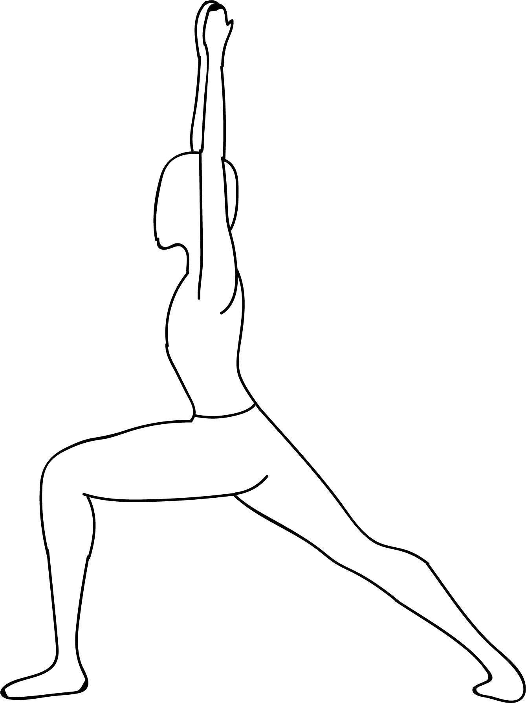

# Nama Baddha Hasta Virabhadrasana

**Nama Baddha Hasta Virabhadrasana** is an Asana. It is translated as Bowing Hands Bound Warrior Pose from Sanskrit.

The name of this pose comes from "nama" to "bow", "baddha" meaning "bound", "hasta" meaning "hand", "Virabhadra" in reference to a legendary warrior, and "asana" meaning "posture" or "seat".

This pose is a warriation of warrior poses and is part of the warrior pose sequence.

## Benefits and Cautions
This pose has many benefits: it stretches the chest and front shoulders, opens the inside of the hip and strengthens the legs.

Avoid this pose if you have ankle, knee, shoulder or lower back injuries.
