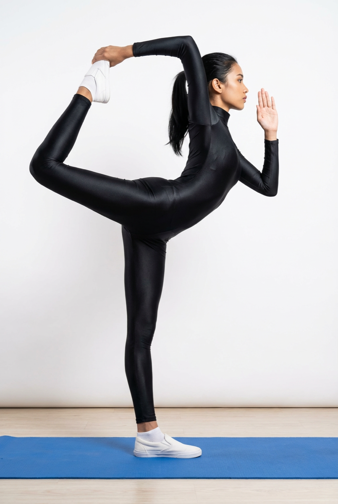

# Natarajasana

[TOC]

**Nat** means **Dance** and **Raja** Means **King**. So this pose is called as Natarajasana yoga pose. This pose helps to improve the balance of the body, concentration. Strengthens the muscles of hip, thighs, and chest.

## Technique
1. Begin standing upright with your feet together and the arms by your sides like in Tadasana – The Mountain Pose
1. Breathe in and bow the right leg backwards, while extending your right hand to  hold the raised foot.
1. Find your balance and stretch your left arm frontwards.
1. Keep on raising the left arm upwardly till it is approximately 45 degrees from the floor.
1. Try to lift your right leg in a curve with the right hand as high as you can manage.
1. Hold your balance and maintain the pose, respiring gently through the nostrils.
1. Hold your gaze frozen just above the distance
1. Keeping account of your breaths, stay in Natarajasana for 30-40 seconds initially. You may increase the time to 1 minute as you gain experience through practice.
1. Gradually lower your leg as you return to the initial pose of Tadasana.
1. Repeat the asana for your left leg accordingly.
1. Practice this posture 5 times for each leg.

## Technique in pictures/animation
## Effects
* Strengthens legs hips, ankles, and chest.
* Helps to reduce weight.
* Stretches the thighs, groin, and abdominal organs.
* improves posture and your balance.
* Improves digestive system.
* Good for Improving concentration.
* Releases stress and calm the mind.

## Related Asanas
* [Adho Mukha Vrksasana](Adho_Mukha_Vrksasana.md)
* [Dhanurasana](../yoga/Dhanurasana.md)
* [Eka Pada Rajakapotasana](../yoga/Eka_Pada_Rajakapotasana.md)
* [Gomukhasana](../yoga/Gomukhasana.md)
* [Hanumanasana](../yoga/Hanumanasana.md)

## Special requisites
It is essential to practice this pose correctly to avoid injury:

* Avoid this asana at all costs if you have low blood pressure.
* You could ask your instructor to help you gain balance when you begin practicing this asana. It is best that you consult a doctor before you do this asana.

## Initial practice notes
As a beginner, you might have a tendency to cramp the back of your thigh. You must ensure that the ankle of the raised foot is flexed. For this, you must move the top of your foot closer to the shin.

## References

## External Links
* [Natarajasana on spotebi.com](https://www.spotebi.com/exercise-guide/lord-of-the-dance-pose/)
* [Natarajasana on theayurveda.org](https://www.theayurveda.org/yoga/health-benefits-of-natarajasana)
* [Natarajasana on sarvyoga.com](https://www.sarvyoga.com/natarajasana-lord-of-the-dance-pose-steps-and-benefits/)

## References

1. ["Methodology"](https://arogyayogaschool.com/blog/health-benefits-natarajasana-lord-dance-pose/)
2. [tips"]("Beginers)(http://www.stylecraze.com/articles/natarajasana-lord-of-the-dancers-pose/#Beginner’sTip)
3. [benefits"]("Health)(https://eyogaguru.com/natarajasana-lord-of-the-dance-yoga-pose-benefits-and-steps/)
