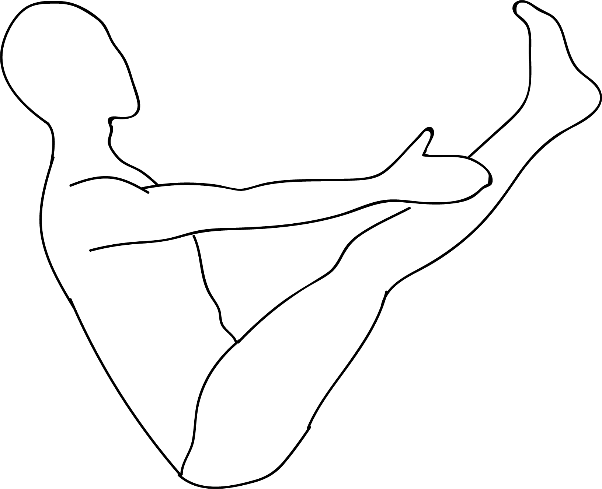

# Navasana

[TOC]

The **Full Boat Pose** or **Paripurna Navasana** may look like a basic pose but the pose is known to be a lot more challenging than it actually seems. The Full Boat Pose requires a great deal of core strength along with a fair amount of flexibility and endurance of the body.

## Technique
1. Begin seated on the floor with your legs extended out forward
1. Place your hands on either side of your torso by your hips, with your fingers pointing forward
1. With an elongated spine, engage your core by activating your lower abdominals while focusing on your breath
1. Lengthen your body from your hip bones right to the top of your head
1. Start to lean back onto your sitting bones (not your tailbone), while keeping a straight neutral spine and lower abdomen slightly engaged, on an exhale bend both your knees and lift your feet and shins parallel to the mat
1. Maintaining your upper body, start to extend your legs, raising the tips of your toes to eye level or above
1. Reach the final position by extending your arms parallel to the floor or take them into whatever expression you feel is appropriate for you

## Technique in pictures/animation
## Effects
* Tones and strengthens your abdominal muscles
* Improves balance and digestion
* Stretches your hamstrings
* Strengthens your spine and hip flexors
* Stimulates the kidneys, thyroid and prostate glands, and intestines
* Aids in stress relief
* Improves confidence

## Related Asanas
* [Adho Mukha Svanasana](../yoga/Adho_Mukha_Svanasana.md)
* [Uttanasana](../yoga/Uttanasana.md)

## Special requisites
This asana must be avoided if you are suffering from the following problems:

* Asthma
* Diarrhea
* Headaches
* Heart problems
* Insomnia
* Low blood pressure
* Menstruation
* Pregnancy

## Initial practice notes
As a beginner, to prepare for this pose, you could do this while sitting on your office chair:

* Sit on the edge of your chair, with your knees placed at a 90-degree angle.
* Hold the sides of your chair and lean forward.

## References

## External Links
* [Navasana on yogajournal.com](https://www.yogajournal.com/poses/full-boat-pose)
* [Navasana on artofliving.org](https://www.artofliving.org/yoga/yoga-poses/boat-posture)
* [Navasana on rishikulyogshala.org](https://www.rishikulyogshala.org/the-health-benefits-of-navasana-boat-pose/)

## References

1. ["Methodology"](https://arogyayogaschool.com/blog/health-benefits-of-navasana-the-boat-pose/)
2. [tips"]("Beginers)(http://www.stylecraze.com/articles/paripurna-navasana-full-boat-pose/#gref)
3. [benefits"]("Health)(http://www.cnyhealingarts.com/2011/04/11/the-health-benefits-of-paripurna-navasana-full-boat-pose/)
