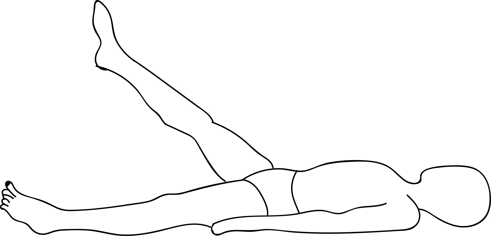

# Niralamba Baddha Eka Pada Uttanasana

[TOC]

**Niralamba Baddha Eka Pada Uttanasana**  is an Asana. It is translated as Unsupported Bound One Legged Intense Stretch Pose from Sanskrit.
The name of this pose comes from "niralamba" meaning "unspupported", "baddha" meaning "bound", "eka" meaning "one", "pada" meaning "foot", "uttana" meaning "intense stretch" and "asana" meaning "posture" or "seat". This pose is a variation of Uttanasana.

## Benefits
1. It opens the hamstrings and front of thighs
1. Stretches the lower back and front shoulders
1. It stimulates the internal organs and promotes a sense of balance.

## Cautions
* Be careful while doing this pose if you have any ankle, knee, hip, lower back or shoulder injuries or if you have high blood pressure.

## References

## References

1. ["wikipedia"](https://en.wikipedia.org/wiki/Niralamba_Baddha_Eka_Pada_Uttanasana)
