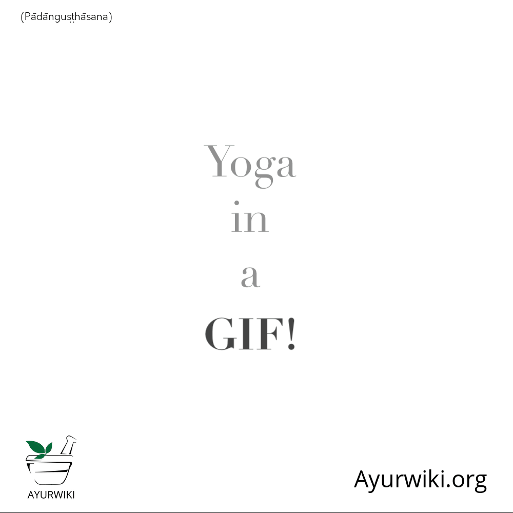

# Padangushtasana

[TOC]

## Technique
1. Stand, Legs should be straight and also your legs gap was at least six inches.
1. Now arrange the quadriceps, outside heel protection.
1. Bend front and try to touch forehead to knee at that time your legs are in straight position. Head and torso has move simultaneously.
1. In this position grasp your toes, fingers of foot. Once you are in this position, grasp your big toes with fingers of each foot. Grip the toes resolutely with fingers.
1. Use your hand to press the toes, you can’t hold your toes that time you have change the position. In that time you also use strap and band to    catch and hold your toes as a substitute.
1. Set straight the elbows and raise the torso at that time you inhale.
1. Without stress any other parts of our body you have done this as lofty as.
1. Relax toes and torso that time exhale. Again and again do this.
1. Unbend and go to the beginning position in that time also grasping your toes. Repeatedly do exhalation and inhalation. Each time increase widen of torso.
1. Gradually release the strap and straighten and go to the starting stage.

## Technique in pictures/animation
## Effects
* Reduce diabetes.
* Toe to head improve flexibility.
* Improves preservation and concentration power.
* Control nervousness.
* Increase inhale and exhale density.
* Increase the brains blood flow.
* Stretching hamstrings, knees, muscles calf muscles, lower back, back and arms.
* Relieves excess gas inside the body.
* Manage spleen and liver.
* Women try to conceive that time this asana stretches all muscles.
* Balance body and mind.
* Strengthen bones, spine and legs.
* Relieve insomnia and headaches.
* Cure high blood pressure.

## Related Asanas
## Special requisites
## Initial practice notes
## References

## External Links
* [Padangushtasana on stylecraze.com](https://www.stylecraze.com/articles/padangusthasana-big-toe-pose/#gref)
* [Padangushtasana on yogawiz.com](http://www.yogawiz.com/yoga-poses/standing-poses/big-toe-pose.html)
* [Padangushtasana on yogajournal.com](https://www.yogajournal.com/poses/big-toe-pose)

## References

1. [Benefits"]("Health)(http://www.dolittleyoga.com/pose-steps-and-benefits-of-padangusthasana/)
