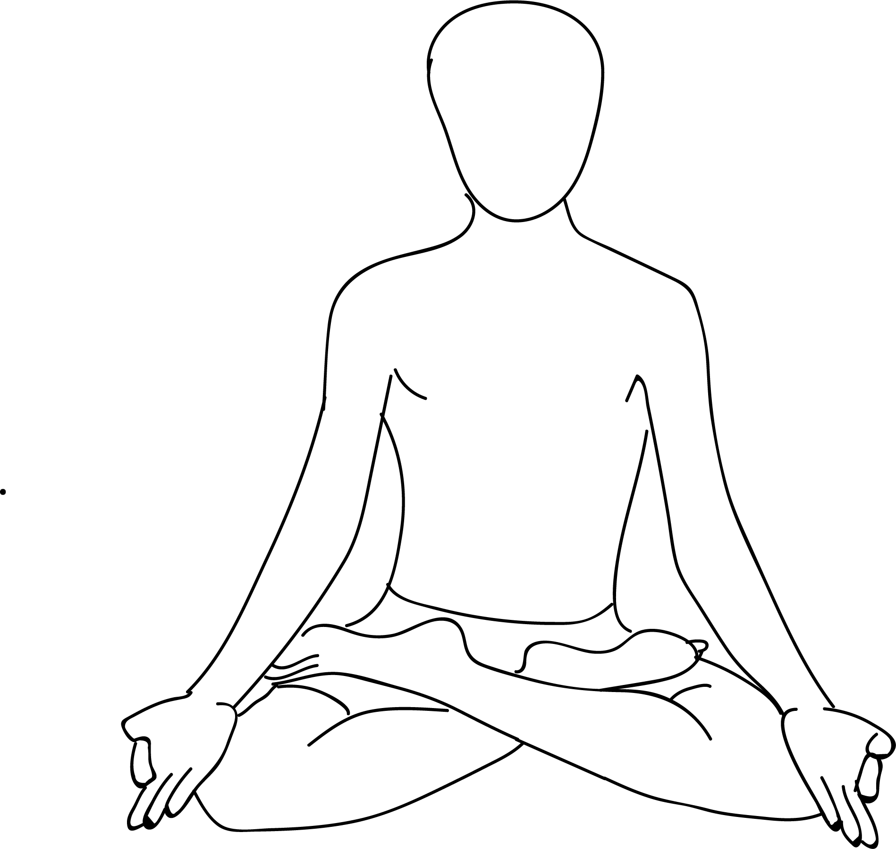

# Padmasana

[TOC]

The **Padmasana** or **Lotus Position** is a cross-legged sitting asana originating in meditative practices of ancient India, in which the feet are placed on the opposing thighs. It is an established asana, commonly used for meditation, in the Hindu Yoga, Jain and Buddhist contemplative traditions. The asana is said to resemble a lotus, to encourage breathing proper to associated meditative practice, and to foster physical stability.

This is one of the Asanas prescribed in [Hatha Yoga Pradipika](Hatha_Yoga_Pradipika_(book).md).

## Technique
1. Sit on the floor with your stretched legs.
1. Now, hold the right leg with both the hands and fold it gently and slowly to keep it over the left thigh.
1. Do keep in mind that the foot is touching the navel.
1. Now do the same with the left leg. Hold the left leg with both the hands and fold it to place over the right thigh.
1. Make sure at this position, your knees are touching the ground and both the feet are headed up with the spinal cord absolutely straight.
1. Put your both the palms on the knee joints facing upside down with the thumbs touching the index finger and rest other fingers facing up.
1. Keep your eyes closed for one minute and then slowly open the eyes and relax yourself in the Padmasana.
1. Continue this asana for at least 15-20 minutes or as long as you can for best benefits.

## Technique in pictures/animation
## Effects
* Opens up the hips
* Stretches the ankles and knees
* Calms the brain
* Increases awareness and attentiveness
* Keeps the spine straight
* Helps develop good posture
* Eases menstrual discomfort and sciatica
* Helps keeps joints and ligaments flexible
* Stimulates the spine, pelvis, abdomen, and bladder
* Restores energy levels

## Related Asanas
* [Ardha Matsyendrāsana](Ardha_Matsyendrāsana.md)
* [Baddha Koṇāsana](Baddha_Koṇāsana.md)
* [Virasana](../yoga/Virasana.md)
* [Janu Sirsasana](../yoga/Janu_Sirsasana.md)

## Special requisites
* Avoid doing this asana if you have a knee or ankle injury.
* This asana must be practiced under the guidance of an experienced teacher, especially if you are a novice to this pose. It might look simple, but it is not.

## Initial practice notes
As a beginner, you could overstretch your ankle as you get into the pose. To avoid this, you must push the inner side of the foot against the upper part of your arm so that your ankle’s stretch is balanced. Also, when you bring your foot near the opposite groin, make sure the stretch in the inner and outer ankle remains the same.

## References

## External Links
* [Padmasana on cnyhealingarts.com](http://www.cnyhealingarts.com/2010/12/10/the-health-benefits-of-padmasana-lotus-pose/)
* [Padmasana on chikitsa.com](https://www.chikitsa.com/benefits-of-padmasana)
* [Padmasana on easyayurveda.com](https://easyayurveda.com/2018/01/24/padmasana-lotus-pose/)
* [Padmasana on 7pranayama.com](https://7pranayama.com/padmasana-steps-lotus-position-benefits/)

## References

1. [Methodology](https://www.epainassist.com/yoga/padmasana-or-lotus-pose)
2. [tips](Beginers)(http://www.stylecraze.com/articles/padmasana-lotus-pose-and-benefits/#Beginner’sTip)
3. [benefits](Health)(https://arogyayogaschool.com/blog/benefits-lotus-pose-padmasana/)
