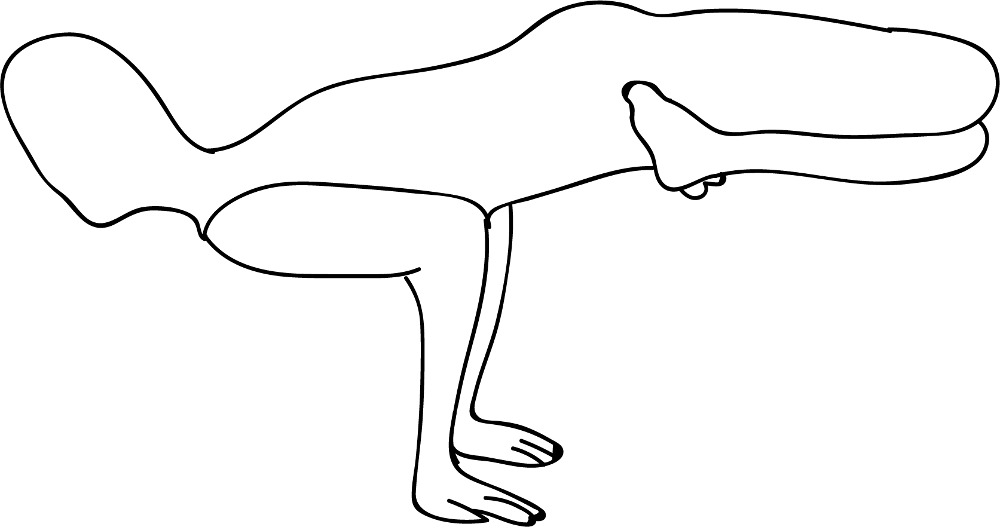

# Padmasana in Mayurasana

[TOC]

**Padmasana in Mayurasana** is an Asana. It is translated as **Lotus Pose in Peacock Pose** from **Sanskrit**. the name of this pose comes from **padma** meaning **lotus**, **mayura** meaning **peacock**, and **asana** meaning **posture** or **seat**.

## Technique
1. First of all start with; Padmasana… then
1. Place your palms on the front after inverting your fingers (the fingers are pointing towards your body and wrists are to the front. Fingers should be well spread.
1. Shift the weight of your body on your hands by raising padmasana slowly.
1. Keep the torso horizontal.

## Technique in pictures/animation
## Effects
* Strengthens the forearms, wrists, and elbows
* Improves flexibility in the knees and ankles
* Massages the abdominal organs
* Improves digestion
* Stimulates the elimination of toxins
* Develops mental and physical balance
* Brings the three Ayurvedic doshas into harmony

## Related Asanas
* [Adho Mukha Svanasana](../yoga/Adho_Mukha_Svanasana.md)

## Special requisites
If you have any of the following disorders please don’t try this; High BP, hernia, heart disease, any type of ulcer, physical weakness, pregnancy, weak
wrists and arms.

## Initial practice notes
## References

## External Links
* [Padmasana in Mayurasana on yogaindailylife.org](https://www.yogaindailylife.org/system/en/level-8/bandha-mayurasana)
* [Padmasana in Mayurasana on pranayoga.co.in](http://pranayoga.co.in/asana/padma-mayurasana-lotus-peacock-posture/)
* [Padmasana in Mayurasana on yogicwayoflife.com](http://www.yogicwayoflife.com/padma-mayurasana-lotus-in-peacock-pose/)

## References

1. ["Methodology"](https://www.completenaturecure.com/lotus-pose-peacock-pose-padma-mayurasana/)
2. [benefits"]("Health)(https://beyogi.com/learn-yoga/poses/lotus-peacock-pose/)
