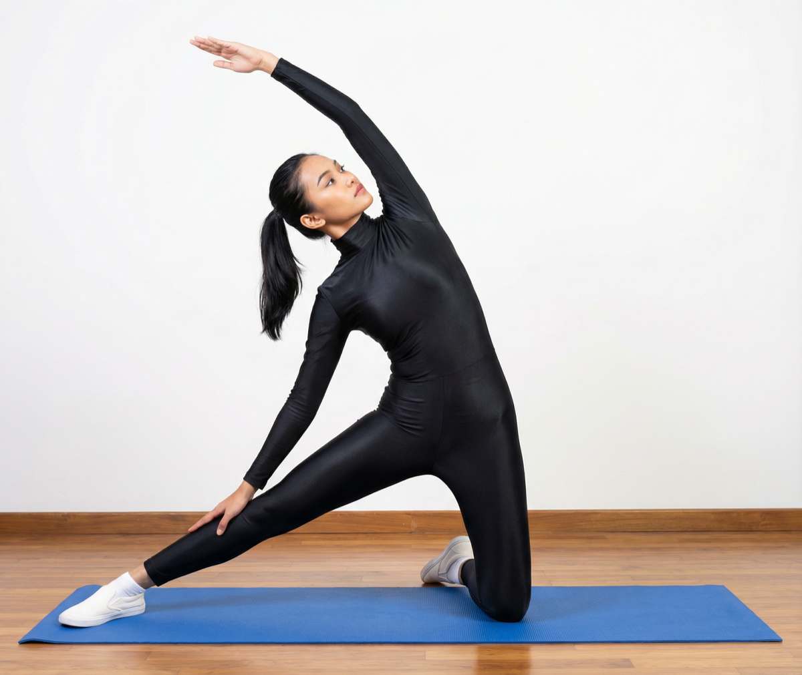

# Parighasana

[TOC]

**Parighasana** is an Asana. It is translated as **Gate Pose** from **Sanskrit**. The name of this pose comes from **parigha** meaning **gate**, and **asana** meaning **posture** or **seat**. It has 2 variations, one performed on the knees and the other sitting on the heel.

## Technique
1. Now extend (stretch) right leg outward on your right side, also rotate your hip outwards in a way that your kneecap faces the roof.
1. Make sure your stretched leg should be parallel as the kneeling knee, and your kneeling knee must be right under the hip of the same leg.
1. Breathe in and extend your left arm over your head, same as your body is extended.
1. Keep your arm close to ear, during this your shoulder blade must be sturdily pressed opposing your back.
1. Breathe out and turn to right side and permit your right hand to rest on your ankle, foot or thigh.
1. Now look up towards the roof or look forward and note that to keep your neck long.
1. Remain in the pose and take a deep breath.
1. Breathe in and slowly release the pose.
1. Relax and repeat the same procedure to the other side.

## Technique in pictures/animation
## Effects
* Stretches the pelvic region of the body.
* Stimulates the functioning of abdominal organs.
* Loosen up the muscles of the back making it more flexible.
* Stretches calves, hamstrings and opens shoulders.
* Stretches the muscles that engage in the breathing mechanism.

## Related Asanas
* [Adho Mukha Svanasana](../yoga/Adho_Mukha_Svanasana.md)
* [Baddha Konasana](Baddha_Konasana.md)
* [Prasarita Padottanasana](../yoga/Prasarita_Padottanasana.md)
* [Supta Padangusthasana](../yoga/Supta_Padangusthasana.md)
* [Upavistha Konasana](../yoga/Upavistha_Konasana.md)

## Special requisites
* Avoid this asana if you have a knee injury. In such situations, you could sit on a chair and practice it, instead of kneeling down.
* In case you have pain in the neck, or if you feel dizzy, set your gaze straight instead of looking up at your hand.

## Initial practice notes
As a beginner, it might be hard for you to press the foot of the straight leg on the floor. You could either raise the ball of the foot on a blanket or use the support of the wall to get this right.

## References

## External Links
* [Parighasana on spotebi.com](https://www.spotebi.com/exercise-guide/gate-pose/)
* [Parighasana on yogauonline.com](https://www.yogauonline.com/yoga-pose-primer/gate-pose-parighasana)
* [Parighasana on yogajournal.com](https://www.yogajournal.com/poses/gate-pose)

## References

1. ["Methodology"](https://www.sarvyoga.com/parighasana-gate-pose-steps-and-benefits/)
2. [tips"]("Beginers)(http://www.stylecraze.com/articles/parighasana-gate-pose/#PrecautionsAndContraindications)
3. [benefits"]("Health)(http://www.finessyoga.com/yoga-asanas/parighasana-steps-precautions-benefits)
