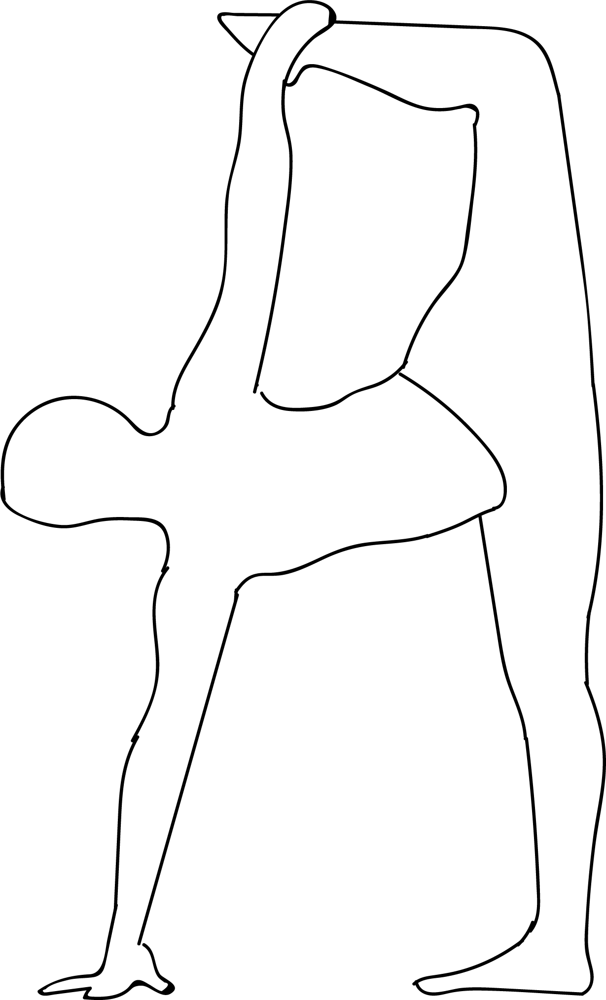

# Parivrtta Ardha Chandrachapasana

[TOC]

**Parivrtta Ardha Chandrachapasana** is an Asana. It is translated as **Revolved Half Moon Bow Pose** from **Sanskrit**. the name of this pose comes from **parivrtta** meaning **revolved**, **ardha** meaning **half**, **chandra** meaning **moon**, **chapa** meaning **bow** and **asana** meaning **posture** or **seat**. This pose is a variation of Ardha Chandrasana.

## Technique
1. Begin in Utthita Trikonasana / Extended Triangle Pose on your right.
1. Place your left hand on your left hip and slowly bend your right knee at a 90 degrees angle.
1. Inhale and place your right hand on the floor about a foot beyond your right toe. If you are not able to reach the floor, use a wooden block and place your palm on it.
1. Exhale and straighten your knees. Lift your right leg up and keep it parallel to the floor.
1. Slowly turn your torso to your left without losing your balance.
1. Bend your right knee and hold your right ankle with your left hand.
1. Balance your body on your left leg and right hand without locking your left knee.
1. Inhale and turn your head to your left.
1. Stay in this pose for 3 long breaths

## Technique in pictures/animation
## Effects
* Relieves stress, anxiety and fatigue.
* Improves coordination and sense of balance.
* Improves flexibility.
* Strengthens the ankles, calves, hamstrings, thighs, spine, wrists, arms and shoulders.
* Massages the abdominal muscles.
* Improves digestion.
* Relieves menstrual discomfort.
* Recommended for people with osteoporosis and sciatica.

## Related Asanas
* [Adho Mukha Svanasana](../yoga/Adho_Mukha_Svanasana.md)

## Special requisites
* Anyone suffering from low blood pressure, migraines, severe leg or spinal injuries.

## Initial practice notes
## References

## External Links
* [Parivrtta Ardha Chandrachapasana on yogajournal.com](https://www.yogajournal.com/practice/to-the-moon)

* [Parivrtta Ardha Chandrachapasana on tummee.com](https://www.tummee.com/yoga-poses/ardha-chandra-chapasana)

## References

1. ["Methodology"](https://365dayspact.wordpress.com/2017/07/13/parivrtta-ardha-chandra-chapasana-revolved-half-moon-pose-be-strong-and-graceful/)
2. [benefits"]("Health)(https://www.sarvyoga.com/bound-revolved-half-moon-pose-baddha-parivrtta-ardha-chandrasana/)
