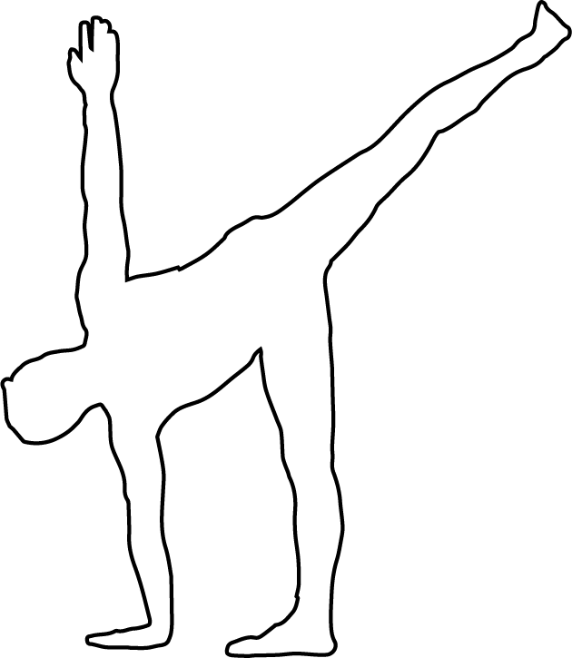

# Parivrtta Ardha Chandrasana

[TOC]

**Parivrtta Ardha Chandrasana** is an Asana. It is translated as **Revolved Half Moon Pose** from Sanskrit. It is a twisting variation of Ardha Chandrasana. the name of this pose comes from **parivrtta** meaning **revolved**, **ardha** meaning **half**, **chandra** meaning **moon**, and **asana** meaning **posture** or **seat**.

## Technique
1. Begin in traditional Half Moon, or Ardha Chandrasana, balancing on your right leg with your left leg extended behind you and your right arm extended to the Earth in front of your right foot.
1. From here, look down and focus on one spot. Begin to square your hips (rather than keeping them stacked) while you reach down to the Earth with your left fingertips.
1. Take your right hand to your right hip.
1. Extend from your tailbone through your crown of head, creating a flat back and long line of energy.
1. Pull your bellybutton in towards your spine and up towards your ribs for stability.
1. Begin to twist your torso (not your hips) to the right to stack your right shoulder on top of your left. If you can access this, begin to reach your right hand towards the sky and if available gaze towards that hand.

## Technique in pictures/animation
## Effects
* Revolved Half Moon Pose has so many awesome benefits. The twisting motion in your torso massages the internal organs and detoxifies the body — stimulating digestion and your metabolism. Gotta love that!
* It really challenges your balance and mental focus. It strengthens the whole body — from the ankles, up the calves and quads, the glutes, abs, lower back muscle,s and arms. It simultaneously stretches the side body, hamstrings, calves, groin and spine.
* On a deeper level, it reduces anxiety, stress, and sluggishness thanks to how it elevates your heart above your head.

## Related Asanas
* [Ardha Chandrasana](../yoga/Ardha_Chandrasana.md)

## Special requisites
It is essential to practice this pose correctly to avoid injury.

* If you are suffering from a neck injury, it might be a good idea to use a thickly folded blanket to support the head.
* You must ensure your spine is absolutely straight while practicing this asana to avoid any kind of injury.
* Pregnant women and women who are menstruating must avoid practicing this asana.
* People suffering from high blood pressure and knee injuries should also avoid this asana.

## Initial practice notes
## References

## External Links
* [Parivrtta Ardha Chandrasana on yogajournal.com](https://www.yogajournal.com/practice/to-the-moon)
* [Parivrtta Ardha Chandrasana on yogauonline.com/](https://www.yogauonline.com/yoga-practice-tips-and-inspiration/yoga-teacher-training-parivrtta-ardha-chandrasana-revolved-half)
* [Parivrtta Ardha Chandrasana on yogalily.com](http://yogalily.com/parivrtta-ardha-chandrasana-revolved-half-moon-pose/)

## References

1. ["Methodology"](https://www.yogaoutlet.com/guides/how-to-do-revolved-half-moon-pose-in-yoga)
2. [benefits"]("Health)(https://www.doyouyoga.com/how-to-do-revolved-half-moon-pose-20544/)
