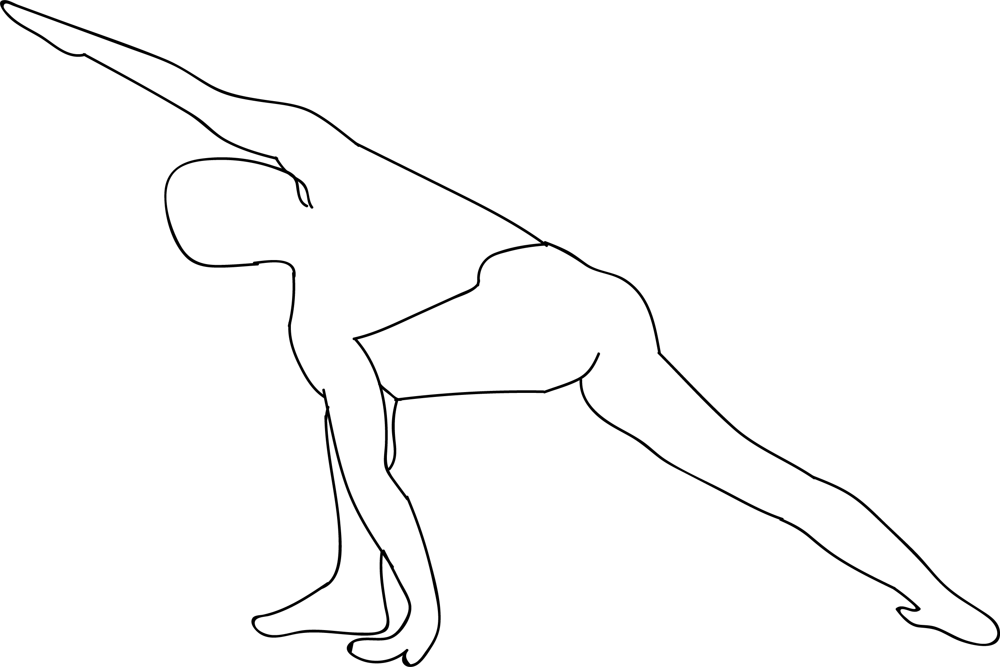

# Parivrtta Parsvakonasana

[TOC]

**Parivrtta Parsvakonasana** is an Asana. It is translated as **Revolved Side Angle Pose** from **Sanskrit**. the name of this pose comes from **parivrtta** meaning **revolved**, **parsva** meaning **side**, **kona** meaning **angle** and **asana** meaning **posture**.

## Technique
1. Keep the neck in a neutral position if you are new to this pose else you are likely to experience a lot of stress in neck muscles.
1. Don’t put the weight completely on your legs and arm, rather try to stretch your body, distributing your weight evenly throughout the body.
1. Avoid practicing this asana in case of severe pain in the neck, back or shoulders.
1. The practice of Extended Side Angle should be avoided in case you suffer from: frequent headaches, high or low blood pressure, migraine, insomnia, joint pain, cervical spondylitis or heart problem.

## Technique in pictures/animation
## Effects
* Strengthens and stretches the legs, knees, and ankles
* Stretches the groins, spine, chest and lungs, and shoulders
* Stimulates abdominal organs
* Increases stamina
* Improves digestion and aids elimination
* Improves balance

## Related Asanas
* [Parivrtta Trikonasana](../yoga/Parivrtta_Trikonasana.md)
* [Baddha Konasana](Baddha_Konasana.md)

## Special requisites
Avoid this pose if you are having following conditions:

* Headache
* High or low blood pressure
* Insomnia

## Initial practice notes
Beginners often have difficulty maintaining their balance in this pose, especially with the back heel lifted off the floor. To improve your balance, support your heel, either by standing it on a sandbag or thick book, or by bracing it against a wall.

## References

## External Links
* [Parivrtta Parsvakonasana on yogaoutlet.com](https://www.yogaoutlet.com/guides/how-to-do-revolved-side-angle-pose-in-yoga)
* [Parivrtta Parsvakonasana on stylesatlife.com](http://stylesatlife.com/articles/parivrtta-parsvakonasana/)
* [Parivrtta Parsvakonasanaon stylesatlife.com](http://stylesatlife.com/articles/parivrtta-parsvakonasana/)

## References

1. ["Methodology"](http://www.finessyoga.com/yoga-asanas/parivrtta-parsvakonasana)
2. [benefits"]("Health)(https://www.yogajournal.com/poses/revolved-side-angle-pose)
