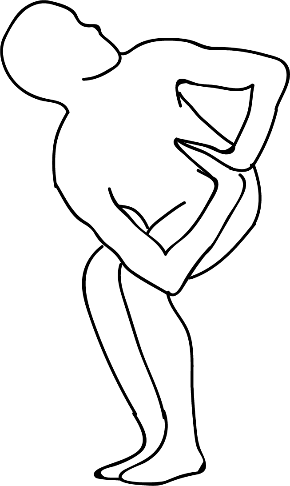

# Parivrtta Prapadasana

[TOC]

**Parivrtta Prapadasana** is an Asana. It is translated as ***Revolved Tip Toe Pose*** from **Sanskrit**.

The name of this pose comes from "parivrtta" meaning "revolved", "prapada" meaning "tip toe", and "asana" meaning "posture" or "seat". This pose is a variation of Prapadasana.

## Benefits
1. It stretched the outside of the thigh.
1. Promotes spinal flexibility and balance.

## Cautions
* It is recommended to be cautious while doing this pose if you have any spinal, knee, ankle, or hip injuries.

## References

## References

1. ["wikipedia"](https://en.wikipedia.org/wiki/Parivrtta_Prapadasana)
