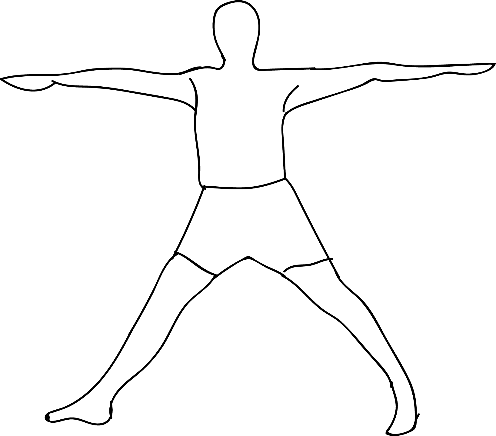

# Parivrtta Salamba Hasta Padasana

[TOC]

**Parivrtta Salamba Hasta Padasana**  is an Asana. It is translated as ***Revolved Supported Hand to Foot Pose*** from **Sanskrit**.

The name of this pose comes from "parivrtta" meaning "revolved", "salamba" meaning "supported", "hasta" meaning "hand", "pada" meaning "foot", and "asana" meaning "posture" or "seat".

## Benefits
1. It promotes spinal flexibility by twisting.
1. Stimulates the internal organs.
1. Stretches the calf muscles and front inner thighs and outer thighs and hamstrings.
1. It promotes a sense of balance and strengthens the core.

## Cautions
* Be careful while doing this pose if you have any spinal, knee, ankle injuries

## References

## References

1. ["wikipedia"](https://en.wikipedia.org/wiki/Parivrtta_Salamba_Hasta_Padasana)
